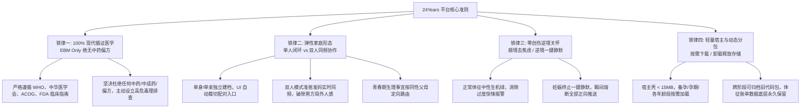
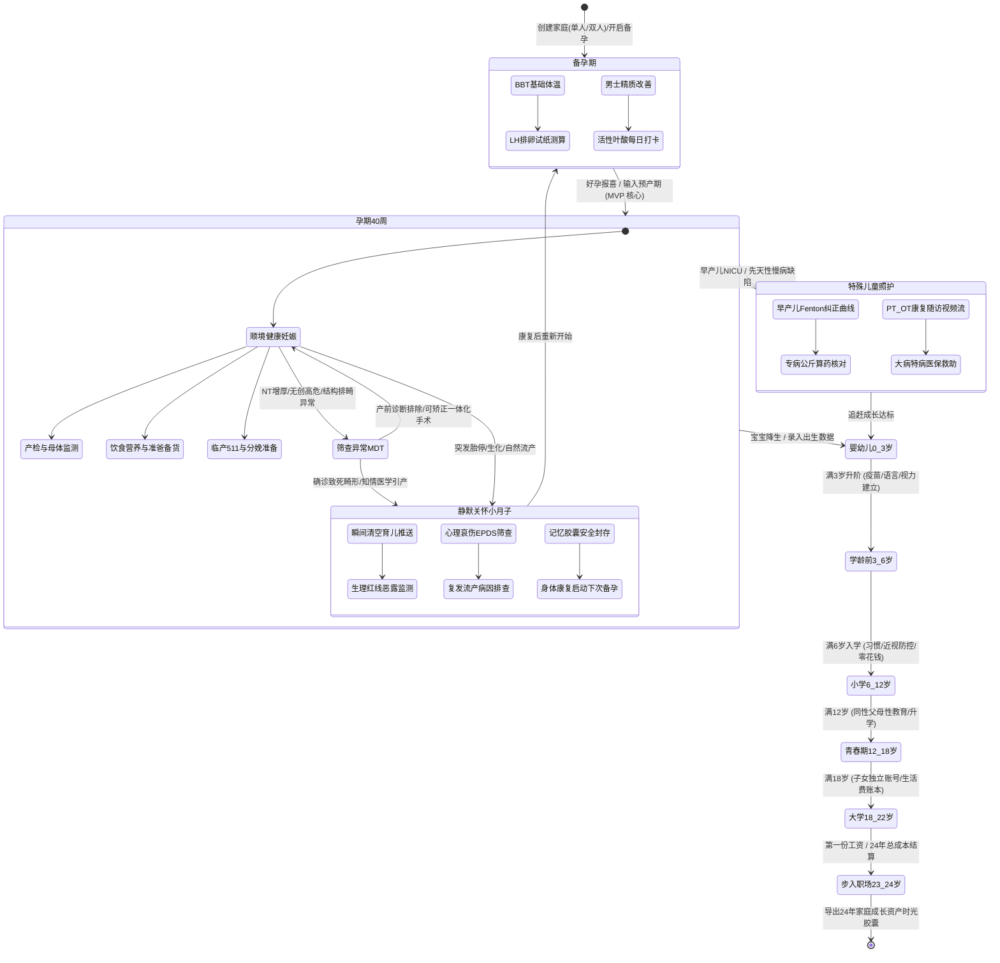
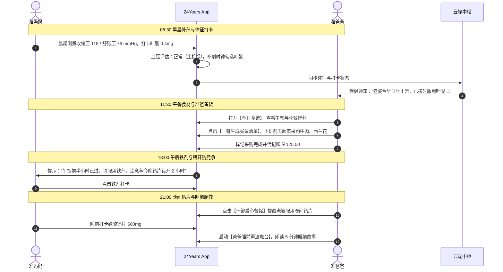
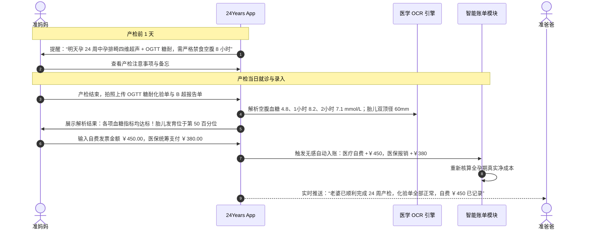
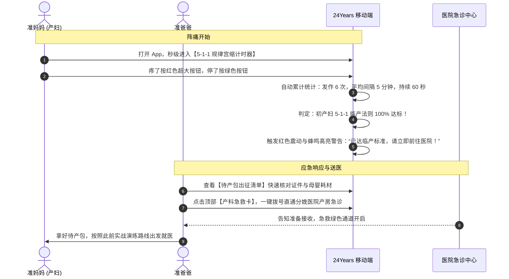
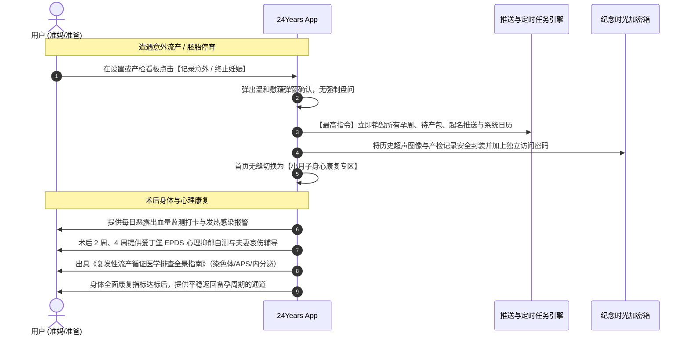
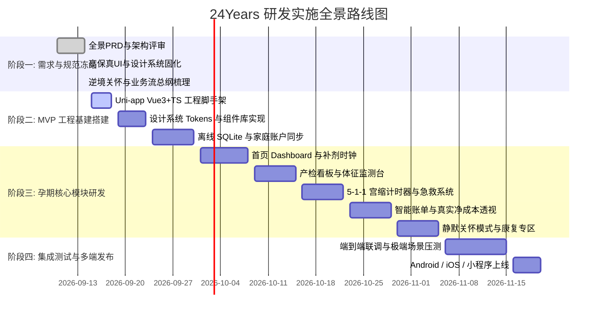

# 24Years 全景需求与业务全流程梳理总纲 (Master Blueprint)

> **文档性质**：项目全局 Source of Truth（统一事实源与全业务全流程总控蓝图）  
> **当前版本**：v2.0.0 (涵盖 24 年全景、MVP 孕期 40 周聚焦、UI 视觉系统与逆境关怀体系)  
> **关联文档**：涵盖 [01 PRD]、[02 全景蓝图]、[03 动态架构]、[04 原型交互]、[05 设计系统] 与 [06 异常关怀]

---

## 一、 项目定位与四大底层铁律 (Core Pillars)

24Years 是一款以 **家庭（Family Unit）** 为组织核心、贯穿 24 年全生命周期的陪伴式养育与成长数字资产平台。全系统在产品设计与代码实现中，严格坚守四大铁律：

---

## 二、 生命周期全景状态机与业务分支 (Global State Machine)

平台贯穿孩子从受孕前到步入社会的 24 年完整旅程。整体状态流转具备高度自适应性，支持正常顺境推进与逆境关怀分流：

---

## 三、 MVP 第一阶段：孕期 40 周五大功能支柱与矩阵

在 MVP 阶段，所有业务紧密围绕 **【孕期 40 周】** 展开，构建 5 大闭环支柱：

### 支柱 1：母体体征与产前医学闭环
- **40 周标准化产检时间轴**：覆盖全孕期 12 次标准产检，标明必查/选查项目、挂号提前量、空腹与化验单拍照 OCR 识别；
- **妊娠期母体监测台**：
  - 早晚血压监测（警戒线：收缩压 $\ge 140	ext{ mmHg}$ 或舒张压 $\ge 90	ext{ mmHg}$，自动触发子痫前期风险拦截）；
  - GDM 妊娠糖尿病控糖工作台（五点血糖打卡：空腹、三餐后 2 小时、睡前）；
  - 28 周+ 科学胎动计数器（2 小时 $\ge 10$ 次标准算法，支持震动实时计次与异常警报）；
- **胎儿终身健康档案**：B超测值（双顶径 BPD、股骨长 FL、腹围 AC、羊水指数 AFI）自动解码为第 10~90 百分位科学区间，拒绝“偏小一周”造成的盲目焦虑。

### 支柱 2：饮食营养与补剂生活闭环
- **“能不能吃”现代医学速查词典**：基于现代生物学与毒理学，科学辟谣“螃蟹/冷饮/山楂滑胎”，标注加工温度（如海鲜中心温度 $\ge 75^\circ	ext{C}$），设立草药与高汞鱼黑榜；
- **分孕周智能食谱与家庭买菜清单**：精细化计算三大营养素热量，根据孕周自动生成食谱，**一键同步为准爸爸的超市/菜场采购清单**；
- **循证科学补剂时钟（铁钙错开吸收）**：
  - 08:30 活性叶酸 0.4mg
  - 13:00 处方复合铁剂（午餐后，配合维生素C促吸收）
  - 21:00 碳酸钙片 600mg（**与铁剂严格错开 2 小时以上**，防止二价金属竞争性抑制）；
- **极简极效营养平衡盘**：优质蛋白、绿叶蔬菜、2000ml 饮水、微量元素微习惯四宫格打卡。

### 支柱 3：家庭协同与准爸爸实战闭环
- **准爸爸每周实战行动卡**：
  - 摆脱男方“局外人”困境：大件备货指导（婴儿车折叠、安全座椅反向 ISOFIX 安装校验）、待产包耗材（产褥垫/NB码尿布）、夜间送医路线掐表实战演练；
  - 睡前陪伴任务：低频声波电台朗读、协助孕妇下肢水肿热敷按摩；
- **双人协同与起名盲选 (Name Matcher)**：
  - 两人独立左右滑动筛选百家起名池（Tinder 式交互），双方都点赞的即刻进入命中列表；
- **科学分娩计划书 (Birth Plan)**：
  - 涵盖陪产意愿、硬膜外无痛分娩、会阴保护、延迟断脐（1~3分钟）、即刻母婴皮肤接触（60分钟），一键导出 A4 供孕 36 周与助产士沟通；
- **身心抚慰与胎教**：孕妇情绪晴雨表、EPDS 抑郁自筛、舒缓轻音乐与古诗词无损音源。

### 支柱 4：全周期智能账单与政策福利闭环
- **「生娃真实净成本」三维对账中枢**：
  - 公式：$$	ext{家庭真实净支出} = 	ext{家庭名义总支出} - 	ext{国家医保统筹报销} - 	ext{生育津贴实收入账}$$
  - 消除盲目恐慌，明晰家庭真实财务成本；
- **业务联动无感记账**：
  - 录入产检化验单 $	o$ 自动沉淀医疗自费流水；
  - 准爸打卡购买推车安全座椅 $	o$ 自动带入母婴大件支出；
- **夫妻出资比例透明化**：清晰记录准爸支付、准妈支付与长辈赞助占比；
- **国家政策福利工具箱**：全国 31 省市法定产假/陪产假计算器、生育津贴申领攻略与材料备忘清单。

### 支柱 5：应急救援与逆境关怀闭环
- **常驻产科急救卡 (Emergency Card)**：顶部胶囊常驻，一键唤出孕周、血型、RH抗体、急诊定点医院与家属电话；
- **5-1-1 规律宫缩极简计时器**：超大防慌乱双色触控热区（红进绿出），自动计算发作频率与持续时间，100% 达标全屏警报就医；
- **破水平卧急救指引**：红色横幅强提示“立即平卧垫高臀部，严禁走动防脐带脱垂”，一键呼叫 120；
- **【一键静默关怀模式】**：
  - 遇流产/胎停/引产，毫秒级清空首页倒计时与所有正向育儿推送；
  - 切换为小月子母体身心康复（恶露/体温/hCG转阴/超声复查/EPDS心理疏导）；
  - 拒绝民间生化汤偏方，指导科学避孕与复发流产病因排查；
  - 历史产检数据加密封存进时光纪念箱。

---

## 四、 四大端到端核心业务闭环时序流程 (E2E User Journeys)

### 业务流程 1：日常双人守护与营养补剂同频流

---

### 业务流程 2：产检就诊、医学化验与财务自动入账流

---

### 业务流程 3：临产应激、5-1-1 规律宫缩与急救就医流

---

### 业务流程 4：逆境阻断、一键静默关怀与身心康复流

---

## 五、 模块与文档矩阵全景索引

| 编号 | 模块 / 规范文件 | 核心职责与设计边界 | 对应源码 / 静态资产 |
| :--- | :--- | :--- | :--- |
| **00** | **全景需求与业务全流程梳理总纲** | **本项目纲领性文档**：全局定位、四大铁律、生命周期状态机、5大支柱、4大 E2E 业务流 | `docs/00_项目全景需求与全流程梳理总纲.md` |
| **01** | **产品需求规格说明书 (PRD)** | 备孕/孕期/0-24岁功能规格细化、医学检验阈值、NFR 性能与安全标准 | `docs/01_产品需求规格说明书_PRD.md` |
| **02** | **产品全景蓝图规划** | 24年生命周期阶段拆解、家庭权限模型、动态包演进路线 | `docs/02_产品全景蓝图规划.md` |
| **03** | **移动端动态架构与云端协同** | 宿主壳技术架构、SQLite 离线优先同步总线、底层 ER 数据实体 | `docs/03_移动端动态模块化与云端协同架构.md` |
| **04** | **页面原型与交互设计规划** | 4-Tab 信息架构、8 套 ASCII 高保真线框图、高保真效果图内嵌 | `docs/04_页面原型与交互设计规划.md` |
| **05** | **UI 视觉风格与设计系统** | 温润粉/生机绿/急救红/OLED夜间纯黑 Token、DIN 等宽排版、SCSS/Tailwind 配置 | `docs/05_UI视觉风格与设计系统规范.md` |
| **06** | **异常妊娠与特殊儿童照护体系** | 产前排畸决策树、终止妊娠【静默关怀模式】、小月子身心康复、Fenton 早产儿曲线 | `docs/06_异常妊娠与特殊儿童照护体系.md` |
| **IMG** | **高保真视觉设计图** | 首页 Dashboard、5-1-1 宫缩计时器、智能账单与生娃净成本效果图 | `docs/assets/*.jpg` (共 3 张) |

---

## 六、 研发实施里程碑与阶段交付计划

