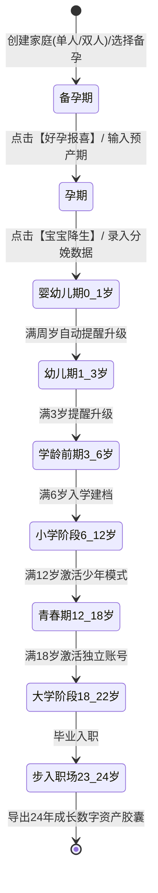

# 24年养育伴随 App 深度产品需求规格说明书 (PRD)

## 零、 核心医疗价值观：100% 现代循证医学（EBM 铁律）

> [!IMPORTANT]
> **本产品坚决奉行纯粹的现代循证医学（Evidence-Based Medicine, EBM）原则，构建清爽、科学、严谨的母婴与家庭健康体系。**

1. **绝对禁入红线**：
   - 严禁收录、推荐或涉及任何中药、中成药、传统草药汤剂、未经验证的偏方秘方、“保胎神药”或药膳食补。
   - 彻底摒弃“寒凉/燥热/发物/胎毒”等非现代医学概念，仅使用现代生理学、病理学、生物化学和微生物学定义。
2. **权威医学依据来源**：
   - 所有孕产、备孕、儿童发育指南严格依照：**WHO（世界卫生组织）**、**中华医学会妇产科学分会/生殖医学分会**、**ACOG（美国妇产科学会）**、**AAP（美国儿科学会）**、**FDA 药品数据库**以及国家卫生健康委官方发布的权威临床路径。
3. **毒理与用药安全主动预警**：
   - 在用药安全库与食物红黑榜中，对“成分不明、缺乏大样本随机双盲对照（RCT）试验、具有潜在肝肾毒性（如马兜铃酸、重金属超标等）的中草药及中成药”提供专门的**高危毒性预警**，严防致畸与器官损伤风险。

---

## 一、 业务流程与核心用户旅程

### 1. 弹性家庭组织形态：单人独立模式 vs 双人协作模式
- **单身/单亲独立模式（Single Mode）**：
  - 用户可能处于单身状态（如女性/男性单身独立备孕、单亲抚养、离异抚养等）。
  - **绝无强制配对门槛**：单人模式下，用户可独立使用全部体征记录、自建日程提醒、消费记账与医疗知识库；界面自动隐藏所有“伴侣绑定”、“互相监督”、“对方打卡”等冗余元素，流程百分之百闭环自洽。
  - **平滑升级机制**：单人模式支持随时生成邀请密钥/二维码，一旦伴侣扫码加入，历史数据即刻转为家庭共有资产，无缝升级为双人模式。
- **双人协作模式（Couple Mode）**：
  - 准爸/准妈双账号绑定，支持实时状态同频、互相督促打卡与账本共记。

### 2. 生命周期状态机跃迁全流程
各阶段业务流与状态机跃迁逻辑如下：

---

## 二、 【模块一：备孕期】详细需求规格 (Preconception Module)

### 1. 准妈妈身体状态与生理监测
- **基础体温监测（BBT）**：
  - 录入规则：每日清晨醒来静止状态测温（支持 35.50℃ ~ 38.00℃，精确到小数点后两位）。
  - 图表输出：双相体温曲线图。系统自动识别“体温骤降日（排卵日）”与“高温持续期（黄体期，持续14天以上提示可能受孕）”。
- **排卵监测工具箱**：
  - 排卵试纸拍照识别：支持主流品牌试纸对比，分为“阴性”、“弱阳”、“阳性”、“强阳（LH峰值，提示24-48小时内排卵）”。
  - 宫颈粘液记录：干燥 / 粘稠 / 蛋清样拉丝（拉丝期提示极佳受孕时机）。
  - 智能黄金受孕日推算：结合历史经期周期（21-35天）、试纸结果与体温，日历上高亮标出“易孕期（排卵日前5天至后4天）”与“排卵黄金日”。
- **月经周期与经期日历**：
  - 记录经期开始/结束、经血量（多/中/少）、痛经等级（1-5级）、血块与伴随症状。

### 2. 准爸爸身体调理与精质提升
- **不良嗜好戒断与激励系统**：
  - 戒烟打卡：每日一记，统计连续未吸烟天数、累计少吸烟支数，提供精子成熟周期（74天）倒计时激励。
  - 戒酒打卡：区分白酒/啤酒/红酒，提示酒精对精子畸形率的医学影响。
- **生活习惯记录**：
  - 作息：记录是否熬夜（23:00后入睡）、每日睡眠时长。
  - 运动：有氧运动（慢跑、游泳、骑行）时长记录。
  - 禁忌预警：高温环境提醒（避免蒸桑拿、泡温泉、长时间久坐）。
- **男方体检指标档案**：
  - 支持录入精液分析常规指标：精液量（ml）、液化时间（min）、精子浓度（百万/ml）、前向运动精子百分比（PR %）、正常形态精子率（%）。标注参考范围与改善趋势。

### 3. 灵活定时任务引擎：用户自建 + 系统官方推荐库
- **核心机制**：
  定时任务**绝非写死**，支持用户完全自由创建，同时系统内置覆盖全生命周期的标准任务模板库，供用户一键采纳或自由魔改。

#### (1) 用户高度自由自建任务能力 (User-Defined Task Engine)
- **任务创建维度**：
  - **任务名称与说明**：支持完全自定义输入（如“喝足2000ml温水”、“做凯格尔盆底肌训练”、“晚间慢跑30分钟”）。
  - **触发周期规则（Cron Engine）**：
    - 每日固定时刻（如每天 08:30）
    - 规律间隔（如每隔 2 天一次、每周一三五）
    - 阶段限定（如仅在孕 28 周 ~ 40 周期间生效）
  - **提醒强度与通道**：
    - 静默角标 / 普通通知栏提醒 / 强震动铃声提醒 / 同步写入系统日历（原生防杀后台）。
  - **责任人指派**：
    - `单人模式`：默认为本人。
    - `双人模式`：可指派给【本人】、【伴侣】或【双人均需完成】。

#### (2) 系统内置官方默认模板库（支持一键添加与二次编辑）
- **备孕期推荐模板库**：
  - `[准妈/准爸] 每日补充活性叶酸`：默认早饭后 08:30，预防神经管畸形。
  - `[准妈] 晨起静止基础体温测量`：默认 07:00 醒来静默提醒。
  - `[准妈] 排卵试纸打卡`：排卵窗口期每日 14:00 试纸检测。
  - `[准爸] 74天精子成熟守护·戒烟打卡`：每日 21:00 总结。
  - `[双人] 健康同频·晚间早睡`：每日 22:30 共同作息。
- **孕期推荐模板库**：
  - `[孕28周+] 每日早中晚3次胎动计数`：10:00、15:00、20:00 各测1小时。
  - `[全孕期] 复合维生素/铁剂/钙片补充`：遵医嘱固定饭后提醒。
  - `[产检前夕] 空腹抽血与证件备忘`：产检前一天 20:00 提醒禁食禁水与资料核验。

#### (3) 双人协同进阶特性（仅双人模式激活，单人模式自动隐藏）
- **跨端爱心督促**：若责任人超时 1 小时未完成核心打卡（如服药），系统自动向伴侣发送提示：“TA似乎还没吃叶酸，快去提醒一下TA吧”。
- **帮TA代打卡**：如一方已倒好温水并监督服药，可直接在自己手机上点击“已帮TA督促服药”，伴侣端弹出确认提示。
- **健康同频成就**：双人连续完成打卡满 30 天，解锁专属纪念勋章。

### 4. 孕前优生健康检查档案 (Pre-pregnancy Checkup)
- 结构化录入男女双方孕前体检清单：
  - **女方必查**：妇科超声、优生四项/五项（TORCH：弓形虫、风疹病毒、巨细胞病毒、单纯疱疹病毒）、甲状腺功能三项（TSH指标对胎儿神经发育至关重要）、血常规与血型（ABO及Rh阴阳性预警溶血）。
  - **男方必查**：精液常规、传染病筛查（乙肝/丙肝/梅毒/HIV）、染色体核型分析（有遗传史家庭）。
  - **异常项高亮**：对超出参考值的指标自动标注黄色或红色警告，并附带医生建议备忘录。

### 5. 备孕期专项账本
- 预置科目分类：
  - `医疗体检`：夫妻双方孕前专项体检费、挂号费。
  - `药品补剂`：活性叶酸片、复合维生素、辅酶Q10、维生素D3、铁剂/钙剂等循证营养补充剂。
  - `辅助器材`：排卵试纸包、电子体温计、验孕棒。
  - `健身调理`：瑜伽课、游泳卡、营养调理餐。
- 统计看板：备孕期累计总花费、单月支出走势、各分类占比饼图。

### 6. 模块跃迁：“好孕报喜”转期仪式
- 用户点击【测出好孕】按钮。
- 输入末次月经第1天（LMP）或 HCG/B超确认受孕日期。
- 系统触发浪漫庆祝动效，生成“我们升级为准爸妈啦”纪念卡片。
- **后台动作**：
  1. 将备孕期数据封存并生成《备孕期健康与花费回顾报告》。
  2. 自动提示下载并挂载【孕期 40 周模块】。
  3. 将首页主界面自适应平滑切换为孕期看板。

---

## 三、 【模块二：孕期 40 周】详细需求规格 (Pregnancy Module)

### 1. 40周标准化产检全流程看板（医学标准知识库集成）
系统根据输入的末次月经时间，自动生成覆盖孕早、中、晚期的标准化产检日历：

| 孕周范围 | 产检序号 | 核心检查项目 | 关键要求与注意事项 | 费用预估/类型 |
| :--- | :--- | :--- | :--- | :--- |
| **6 ~ 8 周** | 第 1 次（建册确诊） | 早期B超（确认宫内孕、胎心胎芽）、孕酮/HCG、基础体检、建母子健康手册 | 需憋尿（经腹B超）或经阴B超；排查宫外孕 | 医保/自费 ￥300-600 |
| **11 ~ 13+6 周**| 第 2 次（早期筛查） | **NT 检查**（颈项透明层厚度）、早期唐筛综合评估 | 严格周数限制；胎儿体位配合，NT > 2.5mm 预警 | 自费 ￥200-400 |
| **16 ~ 18 周** | 第 3 次（中期唐筛） | 中期血清唐筛 / **无创 DNA (NIPT)** / 羊水穿刺评估 | 空腹抽血；评估 21/18/13 三体综合征风险 | 自费 ￥200-2000 |
| **20 ~ 24 周** | 第 4 次（系统大排畸） | **中孕期结构系统排畸超声（四维/三维彩色B超）** | 仔细排查胎儿头颅、颜面、心脏、四肢、脊柱畸形 | 热门项目需提前1月预约 ￥400-800 |
| **24 ~ 28 周** | 第 5 次（妊娠糖耐） | **OGTT 葡萄糖耐量试验**、血常规、尿常规 | 严格禁食8-10小时，喝75g糖水后测空腹/1小时/2小时血糖 | 医保/自费 ￥150-300 |
| **28 ~ 30 周** | 第 6 次 | 产科常规检查、下肢水肿筛查、宫高腹围测量 | 开始进入孕晚期，每两周产检一次 | 基础产检 ￥100-200 |
| **32 ~ 34 周** | 第 7 次（小排畸） | 晚孕期超声检查（评估胎儿生长、胎位、羊水、胎盘成熟度） | 评估胎儿发育是否受限（IUGR）或偏大 | ￥200-500 |
| **36 ~ 37 周** | 第 8 次 | **胎心监护（NST）**、B族链球菌（GBS）筛查、心电图、凝血功能 | 评估分娩方式指征（顺产/剖宫产评估） | ￥200-400 |
| **38 ~ 40 周** | 每周 1 次 | 每周胎心监护、羊水监测、宫颈成熟度检查、临产评估 | 关注见红、破水、规律宫缩等临产征兆 | 每周 ￥150-300 |

### 2. 产检记录与电子病历夹
- **单次产检详情记录**：
  - 就诊信息：就诊日期、就诊医院（三甲/妇幼/私立）、主诊医师、花费总额（自费部分/医保报销部分）。
  - 核心体征指标录入：母亲血压（收缩压/舒张压，排查子痫前期）、体重变化（较孕前增重）、尿蛋白（阴性/阳性）、宫高/腹围。
  - 报告单影像云存储：拍照上传超声图、化验单，支持高清无损查看。
  - 医生指导与下次预约时间：自动根据下次时间生成日历定时提醒。

### 3. 孕妇日常健康监测与胎动计数器
- **胎动计数器（孕28周后激活）**：
  - 科学算法：每日早、中、晚固定时间各测 1 小时。
  - 计算规则：3次测得胎动数相加乘以 4，即为 12 小时胎动总数。若 12 小时胎动 < 10 次，或连续两小时胎动异常频繁后突减，系统弹出 **红色警急求医指引**。
  - 交互界面：大按钮点击计数，自动过滤 2 分钟内的连续动作（算作一次有效胎动）。
- **孕妇体重管理增长曲线**：
  - 根据孕前 BMI（消瘦、正常、超重、肥胖），绘制个性化的全孕期推荐体重增加区间带。
  - 实时对比当前体重是否在理想安全区间内，预防巨大儿或营养不良。

### 4. 夫妻后勤协作：待产包与月子清单
- **多维度待产包协作清单**：
  - 模块分为：`妈妈用品（分娩包/哺乳包/产后护理包）`、`宝宝用品（衣服/纸尿裤/喂养大件）`、`入院证件资料（双方身份证/结婚证/医保卡/母子手册/准生证/银行卡）`。
  - 双人实时打卡：准爸爸点击“已采购/已装箱”，准妈妈界面打勾同步变绿，避免重复准备。
- **月子期安排规划**：
  - 记录意向月子中心（合同金额、定金、探店对比）或月嫂面试记录（证件、体检报告、排期定金）。

### 5. 孕期食品安全与现代用药指南
- **现代食品安全与营养红黑榜**：
  - 基于现代微生物学与毒理学分类（生肉蛋禽、深海高汞鱼类、未巴氏消毒乳品、加工肉类、含咖啡因饮料、酒精类）。
  - 分级标准：
    - `安心吃`：完全熟透肉类、巴氏杀菌乳制品、低汞海产品（三文鱼、虾等）、富含膳食纤维蔬菜。
    - `限量吃`：含咖啡因饮料（每日摄入量 < 200mg）、高糖热带水果（预防妊娠糖尿病）。
    - `绝对禁食`：未经巴氏消毒奶酪/生奶（防李斯特菌感染致胎死腹中）、生鱼片/未熟肉类（防弓形虫与沙门氏菌）、深海大型肉食性鱼类（鲨鱼/旗鱼，防甲基汞蓄积）、任何形式的酒精（无安全阈值，防胎儿酒精综合征）。
- **现代循证用药安全库与风险预警**：
  - **FDA 标准孕期用药分级**（A/B/C/D/X）速查与中国药典妊娠禁忌西药索引。
  - **高危药物与非循证成分强警示**：专门提示孕期切勿私自服用任何传统草药、中成药复方（如含雄黄、朱砂、马兜铃酸、附子、乌头等已知强毒性、肾毒性或胎儿致畸性成分），任何身体不适必须前往正规医院由专科执业医生开具具有严谨三期临床数据的现代药品。

### 6. 孕期消费账本
- 细分科目：`产检挂号与化验`、`生产住院押金`、`月子中心/月嫂`、`孕妇装备（防辐射服/托腹带/孕妇内衣）`、`宝宝大件采购（婴儿床/推车/安全座椅）`、`母婴日常消耗预备`。
- 报销管理：记录生育险产前检查报销金额、生育津贴申领估算。

---

## 四、 【0 ~ 24岁】后续生命周期模块规划矩阵

为了让系统底层架构与数据库从第一天就支持未来24年的演进，各阶段核心功能规格梳理如下：

| 阶段代号 | 覆盖年龄 | 模块包名 | 核心功能特性 | 重点指标/数据沉淀 |
| :--- | :--- | :--- | :--- | :--- |
| **M3: 新生儿期** | 0 ~ 1 岁 | `pkg-infant-0-1` | 喂养计时（母乳/奶粉毫升数）、尿布性状色卡、睡眠白噪音、**一类/二类国家免疫疫苗接种日程**、WHO婴幼儿生长曲线 | 头围/身长/体重、大动作发育打卡 |
| **M4: 幼儿期** | 1 ~ 3 岁 | `pkg-toddler-1-3` | 辅食过敏排查记录、萌牙乳牙图谱（20颗乳牙出牙时间记录）、自主排便戒尿布训练、语言发展记录 | 词汇爆发量、小儿急疹/发热体温追踪 |
| **M5: 学龄前期**| 3 ~ 6 岁 | `pkg-preschool-3-6`| 幼儿园入园适应打卡、每日服药委托备忘、**儿童视力屈光发育建档（近视防控）**、兴趣启蒙试听课管理 | 屈光度/远视储备量、兴趣班账本 |
| **M6: 小学阶段**| 6 ~ 12 岁 | `pkg-primary-6-12` | 课程作息表、换牙恒牙全景记录、脊柱侧弯筛查、**儿童财商零花钱小账本（亲子存钱罐）**、亲子共读书单 | 恒牙替换完成度、近视度数年增量 |
| **M7: 青春期** | 12 ~ 18 岁 | `pkg-teen-12-18` | 身高突增高峰期追踪（骨龄评估）、青春期同性定向生理卫生指南、心理情绪晴雨表、中考/高考重要升学备忘日程 | 终身高预测对比、课外培训大额支出 |
| **M8: 大学独立**| 18 ~ 22 岁 | `pkg-college-18-22`| **激活孩子端独立 App 账户**、每月家庭生活费划转与自主记账、远距离健康关怀、职业证书考证打卡 | 孩子自主理财习惯、家庭共享照片流 |
| **M9: 步入职场**| 23 ~ 24 岁 | `pkg-career-23-24` | 职业入职纪念、第一笔工资孝心反哺账本、父母体检关怀日历、**24年家庭总养育账单透视分析与时光胶囊总归档** | 24年全生命周期养育总成本报告 |

#### 青春期同性父母定向精准推送规则 (Gender-Matched Parent Routing)
针对青春期敏感的第二性征发育与性心理萌动，系统依据孩子登记的生理性别实施**定向精准推送分流**：

1. **若孩子为男性（男孩）👉 定向推送给【父亲】设备**：
   - **生理事宜**：
     - 首次遗精（生理卫生科普、消除少男负罪与恐慌心理沟通指南）
     - 变声期喉黏膜保护与饮食注意事项
     - 生殖器卫生日常护理（包皮翻洗清洗、包茎/包皮过长专科体检指引）
     - 喉结发育、腋毛/胡须生长与初次剃须指导
   - **心理与行为事宜**：
     - 雄性激素激增期的冲动管理、体格力量认知、尊重女性与身体边界教育。
2. **若孩子为女性（女孩）👉 定向推送给【母亲】设备**：
   - **生理事宜**：
     - 月经初潮前兆警示与初潮应对包准备
     - 经期护理（卫生巾/棉条选用、勤换防感染、痛经的现代循证应对如布洛芬止痛）
     - 乳房发育 Tanner 分期追踪、各阶段少女文胸与运动内衣科学选购
     - 私处弱酸平衡日常护理与防妇科感染常识
   - **心理与行为事宜**：
     - 身体自我主权意识、亲密关系界限认知与自我防范教育。
3. **单亲家庭（异性监护抚养）自适应兜底机制**：
   - **自适应降级识别**：若家庭模式为单亲且监护人与孩子性别相异（如**单亲妈妈带儿子**，或**单亲爸爸带女儿**）；
   - **专项无尴尬沟通指引**：推送时自动附加《单亲异性家长科学陪伴指南》，提供通俗科学的沟通脚本话术、生理用品采购避坑清单，帮助家长坦然、从容跨越性别盲区。

---

## 五、 全局性关键非功能需求 (NFR)

### 1. 模块动态热插拔与存储释放规则
- **下载模式**：进入新阶段时，弹窗提示用户下载新模块包（WiFi下自动下载，移动网络下确认下载），体积通常在 2MB ~ 8MB。
- **卸载与归档**：
  - 用户从【备孕期】进入【孕期】后，备孕模块可点击“归档并卸载模块代码”。
  - **核心铁律**：卸载模块仅清除该模块专用的前端页面和静态资源，**所有历史数据、折线图记录、消费账单永久保存在底层 SQLite 数据库与云端数据库中**。用户可随时在“家庭历史档案馆”中只读查看，或随时一键重新装载该模块。

### 2. 双端数据实时性与离线韧性
- **离线可用（Offline-First）**：在地下车库、医院诊室无网络等弱网环境下，用户依然能流畅录入体温、记账、产检记录。数据先写入本地 SQLite 缓存，网络恢复后自动通过后台同步队列上传云端。
- **冲突解决原则**：同一记录若夫妻两人同时修改，以“最新修改时间戳（Last-Write-Wins）”为准，关键账本数据保留历史版本记录。

### 3. 系统级提醒保活能力
- 提醒采用 **“本地通知调度（Local Notification）+ 云端消息推送（Push Notification）+ 可选系统日历（EventKit/Calendar Provider）”** 三重保障：
  - 核心吃药打卡：直接注册设备本地闹铃与通知，即使无网络也能准时响铃。
  - 跨设备督促提醒：通过云端推送通道发送给对方。
  - 重要产检：自动征得用户同意后同步写入手机系统的原生系统日历，利用系统原生机制防杀后台。
