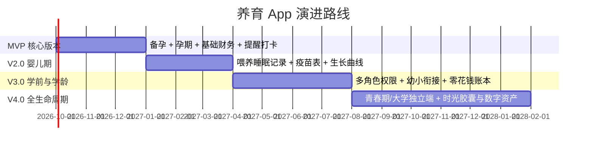

# 24年全生命周期养育伴随 App 产品蓝图规划

## 一、 项目定位与核心愿景

### 1. 定位
一款跨越 **24年（备孕 → 孕期 → 0~24岁孩子毕业入职）** 的一站式家庭成长协作与数字资产管理平台。它不仅是“记录工具”，更是“科学养育助手”、“家庭协作中心”和“人生数字时光胶囊”。

### 2. 核心价值主张
- **陪伴式自适应（Adaptive Engine）**：打破传统母婴App“孩子长大就卸载”的魔咒，随着孩子年龄与生理阶段动态变形界面与核心功能。
- **全家双向/多向协同（Family Collaboration）**：从准爸准妈二人世界，逐步扩展到祖辈/月嫂，最终平滑引入孩子本人作为独立账号主体。
- **从身体健康到财务与心理（Holistic Tracking）**：整合健康指标、定时任务、家庭账本、成长里程碑与情感信箱。

---

## 二、 24年生命周期 8+1 阶段全景拆解

| 阶段 | 年龄/周期 | 核心关注焦点 | 核心功能与打卡项 | 账本支出重点 | 角色参与 |
| :--- | :--- | :--- | :--- | :--- | :--- |
| **0. 备孕期** | 备孕 ~ 怀孕前 | 双方调养、受孕窗口期、戒断与习惯 | 基础体温、排卵试纸、叶酸打卡、烟酒戒断、精卵质量改善、心理减压 | 孕前体检、营养品、中医调理 | 准爸 + 准妈 |
| **1. 孕期** | 40周妊娠 | 母体健康、胎儿发育、产检全流程 | 产检日程（NT/唐筛/排畸等）、体征（体重/血压/血糖/胎动）、用药/饮食禁忌 | 产检化验、母婴大件、待产包、月子中心/月嫂定金 | 准妈 + 准爸 |
| **2. 婴儿与幼儿期** | 0 ~ 3岁 | 生理喂养、睡眠、疫苗与早期发育 | 喂奶/辅食/换布/睡眠节律、疫苗接种表、WHO生长曲线、猛长期与萌牙记录 | 奶粉尿布、推车安全座椅、儿童保险、早教 | 父母 + 祖辈/育儿嫂 |
| **3. 学龄前期** | 3 ~ 6岁 | 幼儿园适应、习惯与潜能探索 | 幼儿园日程、过敏与小儿常见病、视力建档、性格与社交观察、体能打卡 | 幼儿园学费、兴趣班、亲子游 | 父母 + 祖辈 |
| **4. 小学阶段** | 6 ~ 12岁 | 学习习惯、身体突增期、财商启蒙 | 课程/作息表、近视度数追踪、换牙档案、亲子阅读、零花钱/储蓄记录 | 教育培训、托管、课外读物、夏令营 | 父母 + 孩子（启蒙） |
| **5. 青春期** | 12 ~ 18岁 | 生理剧变、心理情绪、中高考升学 | 青春期生理健康、心理晴雨表、升学节点备忘、家庭协议与沟通边界 | 课外学科辅导、中高考备战、成长基金 | 父母 + 孩子（协同主导） |
| **6. 大学独立期** | 18 ~ 22岁 | 独立生活、财务自治、远距离亲情 | 生活费预算与记账协同、职业证书打卡、远方健康互相关怀、家庭数字相册 | 大学学费、生活费、数码大件、考研/留学准备 | 孩子为主 + 父母支持 |
| **7. 步入职场** | 23 ~ 24岁 | 职业起步、反哺家庭、生命回顾 | 第一份工资纪念、父母体检反哺计划、24年养育总成本与时光纪念册导出 | 租房租金、职业启动金、商业重疾险 | 孩子与父母对等交流 |

---

## 三、 核心功能模块设计

### 1. 动态自适应架构（Adaptive Lifecycle Engine）
- **核心逻辑**：根据设定的“当前状态”（备孕中 / 预产期 YYYY-MM-DD / 孩子生日 YYYY-MM-DD），App 会动态重构首页 Dashboard，只展示当前阶段最关注的工具。
- **阶段切换**：支持“备孕成功”一键升级到“孕期”；“宝宝降生”一键升级到“新生儿期”。

### 2. 健康管理与定时提醒中心（Health & Reminder Center）
- **双人健康画像**：
  - 女方：月经周期、排卵监测、孕酮/HCG、体重、孕周体征、产后恢复（盆底肌等）。
  - 男方：精液指标、戒烟戒酒天数、作息达标、运动记录。
- **智能定时任务引擎**：
  - 药物与补剂打卡：支持设定“每天早饭后吃叶酸”、“晚睡前吃钙片”，支持推送通知、震动、微信小程序/短信提醒。
  - 产检全自动看板：输入末次月经时间，自动生成全部12+次标准产检时间轴，提前3天及当天发起提醒。
  - 产检报告归档：支持拍照 OCR 自动提取关键指标（如NT值、唐筛风险系数、糖耐三项指标），标出异常值。

### 3. 全周期养育账本（Parenting Finance）
- **阶段化科目体系**：自动根据当前阶段切换支出分类：
  - 备孕期：体检、补剂、营养、助孕开销。
  - 孕期：挂号检查、化验、防辐射服/孕妇装、待产包、月子中心。
  - 育儿期：消耗品（尿不湿/奶粉）、医疗、教育、亲子出行。
- **双人记账与统计**：支持夫妻共同记账，展示预算消耗比例，支持“24年养育总成本透视报表”。

### 4. 成长记忆与时光胶囊（Digital Capsule & Milestones）
- **精准年龄时间轴**：照片与文字自动打上“孕 24 周 3 天”或“2 岁 4 个月 18 天”。
- **重大里程碑**：第一次听到心跳、第一次胎动、出生第一声啼哭、第一次翻身、第一天上学、高考、入职。
- **未来信箱（Time Capsule）**：父母在孩子各阶段给未来 18 岁或 24 岁的 TA 写信，支持设定在指定时间自动解锁给孩子。

### 5. 家庭权限与协作体系（Multi-Role RBAC）
- **角色矩阵**：
  - **超级管理员（母亲/父亲）**：拥有全部数据读写与隐私权限。
  - **受限成员（爷爷奶奶/外公外婆）**：可看宝宝动态、喂养日常，隐藏敏感财务与私密生理数据。
  - **协作成长账号（孩子独立身份）**：学龄期作为零花钱打卡端；大学后接管记账与日常，但保留家庭连接。

---

## 四、 针对您现有备孕与早期需求的细化方案

### 1. 备孕状态与身体数据项定义
- **女方日常录入项**：
  - 晨间基础体温（生成体温曲线，辅助判定排卵日与黄体功能）
  - 生理周期打卡（经期、经量、痛经程度）
  - 排卵试纸拍照识别（强阳、弱阳智能色卡比对）
  - 身体症状记录（腹痛、情绪、分泌物状态）
  - 补剂提醒（叶酸 0.4mg/0.8mg、辅酶Q10、复合维生素）
- **男方日常录入项**：
  - 禁烟禁酒打卡（戒烟天数打卡，强化心理正反馈）
  - 睡眠与运动记录（步数、运动时长、是否熬夜）
  - 精液检查报告归档（密度、活力A+B级、畸形率等指标趋势）
  - 补剂提醒（锌硒宝、番茄红素、维生素E）

### 2. 产检全周期看板结构
- **孕早期（0-12周）**：早孕确诊、血HCG/孕酮翻倍追踪、6-8周胎心胎芽B超、11-13+6周 NT检查。
- **孕中期（13-28周）**：早期唐筛/无创DNA/羊穿、中孕系统B超（大排畸）、24-28周 糖耐量试验（OGTT）。
- **孕晚期（28-40周）**：小排畸、胎心监护（每周打卡）、骨盆测量、临产前评估。
- **产检记录详情页**：
  - 包含：就诊医院、接诊医生、花费金额、本次检查项目清单、异常项标记、医生建议备注、原始化验单/B超单拍照存档。

---

## 五、 项目实施阶段建议（MVP 到 完整体）

- **MVP 阶段（最推荐先落地的闭环）**：
  1. 角色初始化（准妈妈、准爸爸账号绑定）。
  2. 备孕打卡与身体状态日历（体温、叶酸、烟酒）。
  3. 孕期产检提醒与报告相册。
  4. 极简备孕/孕期消费账本。
- **后续迭代**：逐步开放 0~3 岁新生儿打卡、疫苗接种中心以及家庭共享相册。
