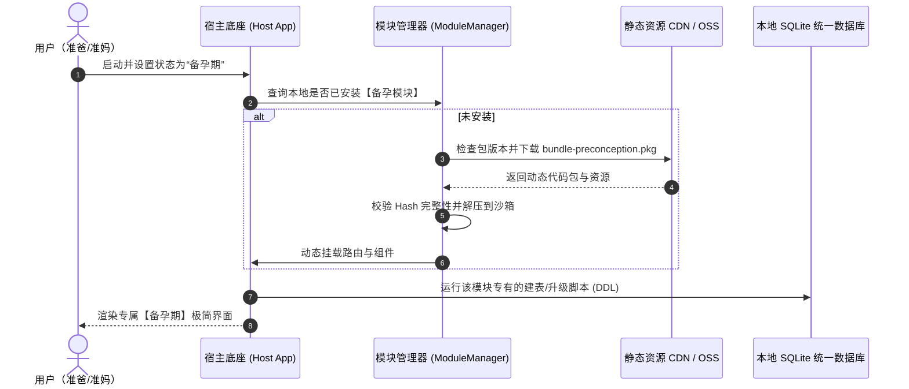
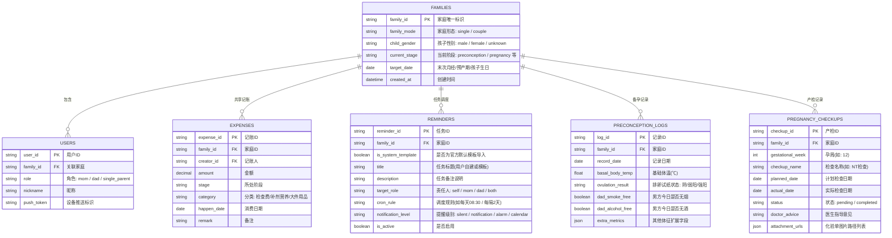

# 移动端动态模块化与云端协同架构设计

根据你的最新决策，我们确立了核心架构方针：**App 手机端 + 夫妻双人绑定 + 云端同步 + 阶段模块化按需动态下载**。

---

## 一、 “按阶段动态下载” 架构设计 (Dynamic Modular Engine)

### 1. 痛点与架构目标
- **痛点**：跨越24年的应用若将所有功能打包进一个安装包，会导致体积膨胀（100MB+），且备孕用户看到高考、大学记账功能会感到杂乱无章。
- **目标**：
  - **超轻量宿主底座（Shell App，<15MB）**：仅包含用户认证、双人组队、云端同步总线、本地数据库和模块下载挂载引擎。
  - **生命周期功能包（Lifecycle Feature Packs）**：以独立插件包（如 `bundle-preconception.pkg`）形式按需下载，每个包仅几兆，解压即用。
  - **生命周期归档与释放**：孩子出生后，用户可选择将“备孕模块”归档卸载（释放手机存储空间，但所有历史记录和账单永久保留在宿主数据库中）。

### 2. 动态模块化运作全流程



### 3. 宿主与模块的代码分层隔离
1. **宿主内核层（固定内置）**：
   - **身份与组队**：JWT鉴权、家庭ID生成、二维码/邀请码绑定。
   - **公共同步引擎**：增量数据云端上传/下发（基于时间戳 + Version 向量）。
   - **本地总线数据仓（SQLite）**：用户表、家庭表、消费账本主表、定时任务调度表。
   - **原生推送通道**：系统日历注入、极光/个推/APNs 原生后台定时提醒。
2. **动态插件层（按需加载）**：
   - `pkg-preconception`（备孕包）：排卵日历算法、基础体温曲线图表、精液与生理指标录入、男性戒断打卡。
   - `pkg-pregnancy`（孕期包）：40周产检全流程甘特图、产检化验单相册、胎动计数器、待产包清单。
   - `pkg-infant-0-1`（0-1岁婴儿包）：喂奶倒计时、大便性状图谱、国家免疫疫苗接种日历。

---

## 二、 家庭组织模式与跨端消息路由 (Family Modes & Notification Dispatcher)

### 1. 弹性家庭形态：单人独立 vs 双人组队
- **单人模式（Single Mode）**：
  - 用户独立建档（单身备孕、单亲抚养）。仅存在单个 `user_id` 关联 `family_id`。
  - 所有任务、体征、账本归属于本人，UI 自动裁切配对与监督入口。
  - 支持随时通过生成 6 位邀请码/二维码平滑升级为双人模式。
- **双人协作模式（Couple Mode）**：
  - 双方通过密钥绑定，`role: 'mom' | 'dad'`。
  - 双方共享数据并支持互相指派任务与超时爱心督促。

### 2. 青春期同性父母精准定向推送路由器 (Adolescent Gender Router)
系统针对青春期（12-18岁）生理健康、性发育等敏感议题，内置智能消息路由算法：

```typescript
// 伪代码：青春期敏感事件推送分流逻辑
interface FamilyContext {
  familyMode: 'single' | 'couple';
  childGender: 'male' | 'female';
  members: Array<{ userId: string; role: 'mom' | 'dad' | 'guardian'; pushToken: string }>;
}

function dispatchPubertyNotification(event: PubertyEvent, family: FamilyContext) {
  const { childGender, familyMode, members } = family;
  const dad = members.find(m => m.role === 'dad');
  const mom = members.find(m => m.role === 'mom');

  if (childGender === 'male') {
    // 男孩生理健康（遗精、变声、包皮清洁等）优先推给父亲
    if (dad) {
      sendPushNotification(dad.pushToken, event.payloadForFather);
    } else {
      // 单亲降级：单亲妈妈抚养男孩，推送给母亲并附带《单亲妈妈陪伴男孩青春期科学指南》
      const singleParent = members[0];
      sendPushNotification(singleParent.pushToken, {
        ...event.payloadForFather,
        specialGuide: "parenting_guide_mom_to_son_puberty"
      });
    }
  } else if (childGender === 'female') {
    // 女孩生理健康（月经初潮、内衣选购、私处护理等）优先推给母亲
    if (mom) {
      sendPushNotification(mom.pushToken, event.payloadForMother);
    } else {
      // 单亲降级：单亲爸爸抚养女孩，推送给父亲并附带《单亲爸爸陪伴女儿初潮与青春期指南》
      const singleParent = members[0];
      sendPushNotification(singleParent.pushToken, {
        ...event.payloadForMother,
        specialGuide: "parenting_guide_dad_to_daughter_puberty"
      });
    }
  }
}
```

---

## 三、 MVP阶段 核心数据库模型设计 (Database Schema)

底层采用 **“统一大账本 + 阶段专用业务表 + 弹性自建任务库”** 设计：



---

## 四、 移动端技术选型推荐

要实现 **跨 iOS/Android + 动态按需加载模块 + 强后台推送**，推荐以下两种技术方案：

| 方案 | 架构组合 | 模块动态下载实现方式 | 优势 | 推荐度 |
| :--- | :--- | :--- | :--- | :--- |
| **方案 A (推荐)** | **Uni-app (Vue 3 + TS) + 原生离线包/分包引擎** | 1. 线上主包极小<br>2. 各阶段作为独立子包/WGT热更资源包，由宿主动态从云端下载并解压装载。 | 1. 国内生态完善，原生推送、微信生态支持成熟。<br>2. 学习曲线平缓，全端支持。<br>3. 极其容易实现热重载与模块下发。 | ★★★★★ |
| **方案 B** | **React Native + Re.Pack (Module Federation)** | 利用 Webpack Module Federation 将备孕、产检拆分成独立的 Remote JS Chunks 异步载入。 | 1. 原生性能与手感好。<br>2. 现代化微前端架构。 | ★★★★☆ |
| **方案 C** | **Flutter + Hybrid Web/Engine** | 核心壳原生 Flutter，各阶段业务采用离线高保真 WebContainer/Flutter Dynamic 模块加载。 | 1. 极高颜值的图表和动画。<br>2. 动态下发在 iOS 端受到苹果审核策略限制较严格。 | ★★★☆☆ |

---

## 五、 后续开发推进路线

1. **Step 1（接口与数据库定义）**：编写 RESTful / WebSocket API 接口契约，确定双人同步机制。
2. **Step 2（宿主框架搭建）**：初始化客户端工程，实现家庭创建、邀请码配对和主壳框架。
3. **Step 3（开发 Module 1：备孕模块）**：实现双方健康打卡、定时吃药提醒、备孕专属记账。
4. **Step 4（开发 Module 2：孕期模块）**：实现产检全周期看板、报告云相册、孕期记账。
