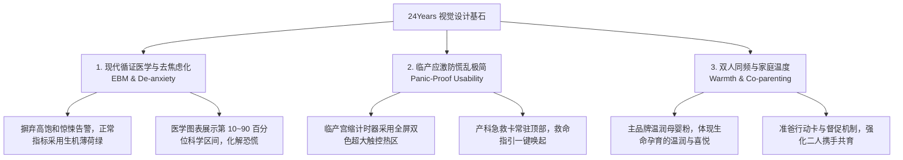
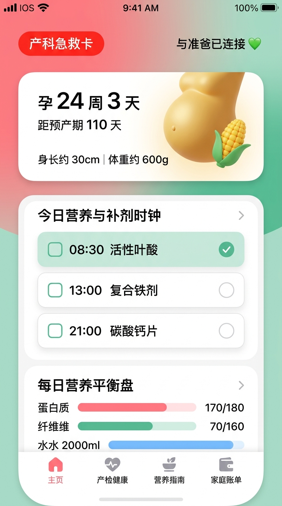
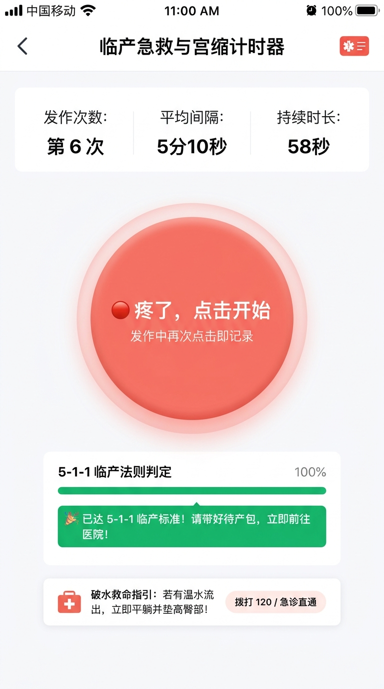
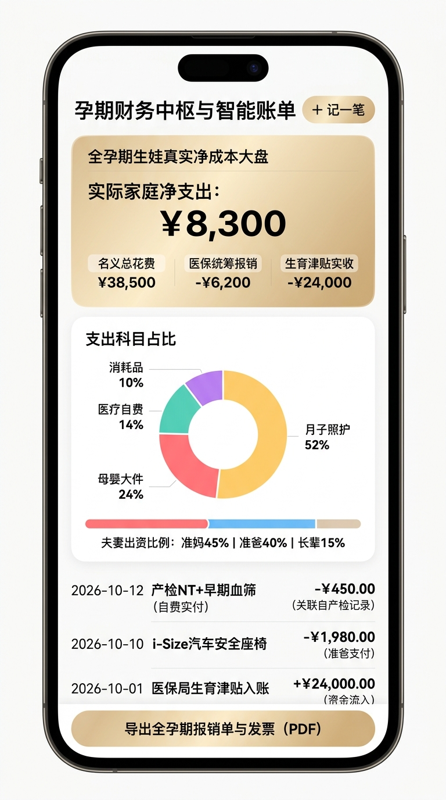

# 24Years 移动端 UI 视觉风格与设计系统规范 (Design System & Tokens)

> **设计基准版本**：v1.0.0 (MVP 孕期阶段聚焦)  
> **适用终端**：iOS / Android / 微信小程序 (Uni-app 跨端框架)  
> **关联效果图**：[docs/assets/01_home_dashboard.jpg](./assets/01_home_dashboard.jpg) 等三套高保真效果图

---

## 一、 设计哲学与品牌基因 (Design Philosophy)

24Years 是一款贯穿 24 年全生命周期的家庭养育平台。在【孕期 40 周】这一核心攻坚阶段，设计系统遵循三大基石准则：



1. **现代循证医学与去焦虑化 (EBM & De-anxiety)**：
   - 告别传统母婴软件常见的“过度恐吓式营销”与虚假红字警告。
   - 绝大多数身体指标处于正常波动区间时，采用舒缓的**生机薄荷绿**；仅在真正触碰子痫高血压、破水、胎动异常等危急红线时，才启动高对比度**医疗急救红**。
2. **临产应激防慌乱极简 (Panic-Proof Usability)**：
   - 针对阵痛来临、深夜破水等极端紧张场景，界面自动屏蔽所有次要杂讯，只呈现核心决策按钮（最小触控尺寸 $\ge 220 	imes 220	ext{px}$），单手盲按防误触。
3. **双人同频与家庭温度 (Warmth & Co-parenting)**：
   - 选用温润粉与柔和奶油白底色，消除冰冷医疗器械感；通过夫妻打卡徽章与账单共同体视图，营造并肩作战的家庭氛围。

---

## 二、 核心色彩系统 (Color Tokens)

设计系统使用语义化色彩命名，支持标准浅色模式与 OLED 纯黑极简夜间模式。

### 1. 品牌与功能主色 (Functional Colors)

| 色彩角色 | Token 名称 | 色值 (HEX) | RGB / HSL | 使用场景与心理暗示 |
| :--- | :--- | :--- | :--- | :--- |
| **主品牌色** | `--color-primary` | `#FF7A8A` | `rgb(255, 122, 138)` | 核心操作按钮、选中状态、孕周轮盘高亮、温润母婴关怀 |
| **主品牌浅底** | `--color-primary-light` | `#FFF0F3` | `rgb(255, 240, 243)` | 标签浅底色、未选中药丸徽章、高亮卡片背景 |
| **主品牌深色** | `--color-primary-dark` | `#E05D6F` | `rgb(224, 93, 111)` | 按钮按下态 (Active/Hover)、重点文字 |
| **生机健康绿** | `--color-success` | `#4EBA8E` | `rgb(78, 186, 142)` | 正常体征指标（血压正常、血糖达标）、已完成打卡、食谱安全评级 |
| **健康绿浅底** | `--color-success-light` | `#EBF8F2` | `rgb(235, 248, 242)` | 正常状态标签背景、已完成任务卡背景 |
| **医疗急救红** | `--color-danger` | `#FA5151` | `rgb(250, 81, 81)` | 产科急救卡、子痫高危预警、破水平卧警告、5-1-1 宫缩进行中 |
| **急救红浅底** | `--color-danger-light` | `#FEECEB` | `rgb(254, 236, 235)` | 红色警告横幅底色、高危弹窗提示容器 |
| **财务琥珀金** | `--color-warning` | `#FA8C16` | `rgb(250, 140, 22)` | 账单名义支出总额、待付款项、预算消耗警示 |
| **津贴报销蓝** | `--color-info` | `#2F80ED` | `rgb(47, 128, 237)` | 医保统筹报销入账、生育津贴冲抵收益、科学指南外部引用 |

### 2. 中性色与排印色阶 (Neutral & Typography Colors)

```text
[#1F2D3D] 页面一级主标题 / 核心医学数据 (Title, Display, Data)
    │
[#5A6A85] 二级正文 / 任务描述 / 伴侣状态 (Body Text, Descriptions)
    │
[#8C9BAE] 辅助弱化文字 / 时间戳 / 单位标注 (Captions, Units, Muted)
    │
[#E2E8F0] 细分割线 / 卡片描边 / 禁用状态边框 (Dividers, Borders)
    │
[#F8FAFC] 页面大底色 / 浅灰微质感背景 (Page Canvas)
```

### 3. OLED 纯黑夜间护眼模式 (True OLED Dark Mode)

专为**夜间孕妇起夜测胎动、突发宫缩记录、新生儿夜奶**场景定制：
- **页面背景底色 (`--bg-page-dark`)**：`#000000`（像素级纯黑，OLED 屏幕发光点全关，极度省电且无微光溢出）。
- **容器卡片底色 (`--bg-card-dark`)**：`#16181D`（深空炭黑，微弱边界区分）。
- **文字与按钮色温**：夜间文字自动压低亮度（主字 `#E2E8F0`，次字 `#94A3B8`），禁止冷光蓝白刺眼，保护褪黑素分泌。

---

## 三、 排版与字阶系统 (Typography)

### 1. 跨平台标准字族

- **中文界面字族**：`PingFang SC, -apple-system, HarmonyOS Sans, MiSans, "Microsoft YaHei", sans-serif`
- **核心数据 / 等宽数值字族**：`"DIN Alternate", "Roboto Mono", "Menlo", monospace`
  - *设计要求*：凡涉及 **孕周天数、倒计时、收缩压/舒张压、宫缩秒数、账单金额**，必须强制使用等宽数值字体，保证数据刷新或计时跳动时不发生横向抖动。

### 2. 层次字阶规范表

| 层级名称 | 字体尺寸 (px/pt) | 行高 (Leading) | 字重 (Weight) | 适用场景 |
| :--- | :--- | :--- | :--- | :--- |
| **Display 1** | `36px` | `44px` | Heavy (700/800) | 5-1-1 宫缩秒数跳字、生娃真实净成本核心大数 |
| **Display 2** | `28px` | `36px` | Bold (700) | 孕周倒计时大数字、体征仪表盘即时读数 |
| **Title 1** | `22px` | `30px` | Bold (600) | 顶部导航栏标题、大卡片主模块标题 |
| **Title 2** | `18px` | `26px` | SemiBold (600) | 任务卡标题、食谱名称、产检就诊项目 |
| **Body (正文)** | `15px` | `22px` | Regular (400) | 循证医学指南详情、备忘说明（**坚决不低于 14px**） |
| **Caption (标注)**| `12px` | `18px` | Regular (400) | 时间戳、出资人标签、医学免责小字 |

---

## 四、 栅格、间距与形状规范 (Layout & Geometry)

### 1. 触控热区准则（符合医学应激人机工学）

- **常规可交互组件最小热区**：$\ge 48 	imes 48	ext{pt}$（如返回箭头、打卡复选框、Tab 栏图标）。
- **临产应激超大热区**：
  - 宫缩计时器主按钮：采用正圆形或圆角矩形，尺寸**不小于 $240 	imes 240	ext{px}$**。
  - 破水呼叫急救热区：全通栏高度 $\ge 64	ext{px}$，红色警示背景。

### 2. 间距系统 (Spacing Scale - 基于 4/8pt 栅格)

- `--space-xs`: `4px`（标签内边距、图标微距）
- `--space-sm`: `8px`（元素间微距、多选标签组间隙）
- `--space-md`: `16px`（标准卡片内边距、列表项常规间距）
- `--space-lg`: `20px`（页面左右安全边距 Padding-X）
- `--space-xl`: `24px`（主区块垂直落差 Margin-Bottom）

### 3. 圆角系统 (Corner Radius)

- **圆润大卡片 (`--radius-card`)**：`16px`（柔化视觉锐角，传递安全、亲和感）。
- **药丸按钮 / 标签 (`--radius-pill`)**：`9999px`（操作胶囊、分类过滤项）。
- **输入框与弹窗 (`--radius-modal`)**：`20px`（底部抽屉 BottomSheet、确认弹窗）。

### 4. 阴影与深度系统 (Elevation / Box Shadow)

- **Level 1 (卡片悬浮)**：`0 4px 16px -2px rgba(31, 45, 61, 0.05)`
- **Level 2 (吸底操作栏 / 弹窗)**：`0 8px 30px rgba(31, 45, 61, 0.12)`
- **Level 3 (红色急救卡外发光)**：`0 0 16px rgba(250, 81, 81, 0.35)`

---

## 五、 三套核心高保真效果图视觉规范详解

### 1. 孕期首页 Dashboard
- **视觉重心**：居中的拟人化发育卡（柔和水彩质感玉米插画）与环形双人状态。
- **补剂时钟设计**：采用时间轴纵向编排，将 08:30 叶酸、13:00 铁剂、21:00 钙片用颜色高亮区分，明确标注“铁钙需错开 2 小时”，用绿色打勾表示已完成。
- **效果图预览**：
  <p align="center">
    
  </p>

### 2. 5-1-1 规律宫缩计时器
- **防慌乱极简美学**：全屏去除所有干扰内容。
- **状态流转双色大按钮**：
  - 初始态：红色呼吸渐变圆，文案清晰“🔴 疼了，点击开始”；
  - 计时中：按钮脉冲扩散动画，文案切换为“🟢 停了，记录本次”；
  - 100% 达标：顶部立即弹出全屏红色浮层，显示就医提示与 120 呼叫入口。
- **效果图预览**：
  <p align="center">
    
  </p>

### 3. 孕期智能账单与真实净成本透视
- **三维阶梯展示法**：
  - 顶部大卡片直接展示公式：`名义总支出 (￥38,500) - 医保报销 (￥6,200) - 生育津贴 (￥24,000) = 真实净支出 (￥8,300)`。
  - 核心净支出采用 `36px DIN Alternate` 字体加粗突出。
- **环形图与出资分布条**：分类清晰，颜色区分度高（月子中心冷紫、大件墨绿、医疗珊瑚红）。
- **效果图预览**：
  <p align="center">
    
  </p>

---

## 六、 前端工程技术落地代码配置 (Code Tokens)

### 1. CSS 变量定义 (`src/styles/variables.css` 或 Uni-app `uni.scss`)

```scss
/* ============================================================
   24Years Design Tokens (Uni-app / Vue3 SCSS Spec)
   ============================================================ */

:root {
  /* 品牌与功能色 */
  --brand-pink: #FF7A8A;
  --brand-pink-light: #FFF0F3;
  --brand-pink-dark: #E05D6F;

  --health-green: #4EBA8E;
  --health-green-light: #EBF8F2;
  --health-green-dark: #3A9671;

  --emergency-red: #FA5151;
  --emergency-red-light: #FEECEB;

  --finance-gold: #FA8C16;
  --finance-blue: #2F80ED;

  /* 文字色 */
  --text-main: #1F2D3D;
  --text-secondary: #5A6A85;
  --text-muted: #8C9BAE;

  /* 背景与表面 */
  --bg-page: #F8FAFC;
  --bg-card: #FFFFFF;
  --border-color: #E2E8F0;

  /* 圆角 */
  --radius-sm: 8px;
  --radius-md: 12px;
  --radius-lg: 16px;
  --radius-full: 9999px;

  /* 字体族 */
  --font-display: "DIN Alternate", "Roboto Mono", monospace;
  --font-sans: -apple-system, BlinkMacSystemFont, "PingFang SC", "HarmonyOS Sans SC", sans-serif;
}

/* OLED 纯黑夜间模式 */
[data-theme="dark"], .dark-theme {
  --text-main: #F1F5F9;
  --text-secondary: #94A3B8;
  --text-muted: #64748B;

  --bg-page: #000000;
  --bg-card: #16181D;
  --border-color: #272A30;

  --brand-pink-light: rgba(255, 122, 138, 0.15);
  --health-green-light: rgba(78, 186, 142, 0.15);
  --emergency-red-light: rgba(250, 81, 81, 0.18);
}
```

### 2. Tailwind CSS / UnoCSS 扩展配置 (`tailwind.config.js`)

```javascript
module.exports = {
  darkMode: ['class', '[data-theme="dark"]'],
  theme: {
    extend: {
      colors: {
        brand: {
          DEFAULT: '#FF7A8A',
          light: '#FFF0F3',
          dark: '#E05D6F',
        },
        health: {
          DEFAULT: '#4EBA8E',
          light: '#EBF8F2',
          dark: '#3A9671',
        },
        emergency: {
          DEFAULT: '#FA5151',
          light: '#FEECEB',
        },
        finance: {
          DEFAULT: '#FA8C16',
          blue: '#2F80ED',
        },
        slate: {
          main: '#1F2D3D',
          secondary: '#5A6A85',
          muted: '#8C9BAE',
        }
      },
      fontFamily: {
        display: ['"DIN Alternate"', '"Roboto Mono"', 'monospace'],
        sans: ['"PingFang SC"', '"HarmonyOS Sans SC"', 'system-ui', 'sans-serif'],
      },
      borderRadius: {
        'card': '16px',
        'modal': '20px',
      },
      boxShadow: {
        'soft': '0 4px 16px -2px rgba(31, 45, 61, 0.05)',
        'emergency': '0 0 16px rgba(250, 81, 81, 0.35)',
      }
    }
  }
}
```

---

## 七、 变更与审核历史

| 版本 | 日期 | 编制人 | 核心变更内容 |
| :--- | :--- | :--- | :--- |
| **v1.0.0** | 2026-09-14 | Antigravity AI & Product Owner | 正式建立 24Years 移动端设计系统，确立温润母婴粉+生机绿+医疗红+OLED夜间模式色彩体系与 DIN 等宽排版规范，固化首页、宫缩计时与智能账单三大高保真视觉效果图。 |
