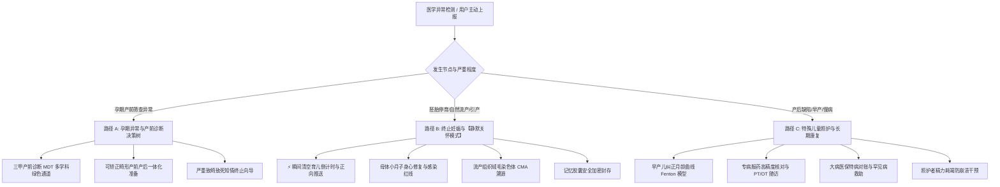
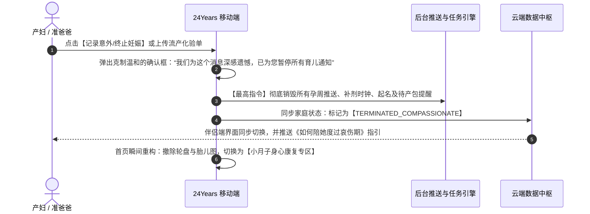
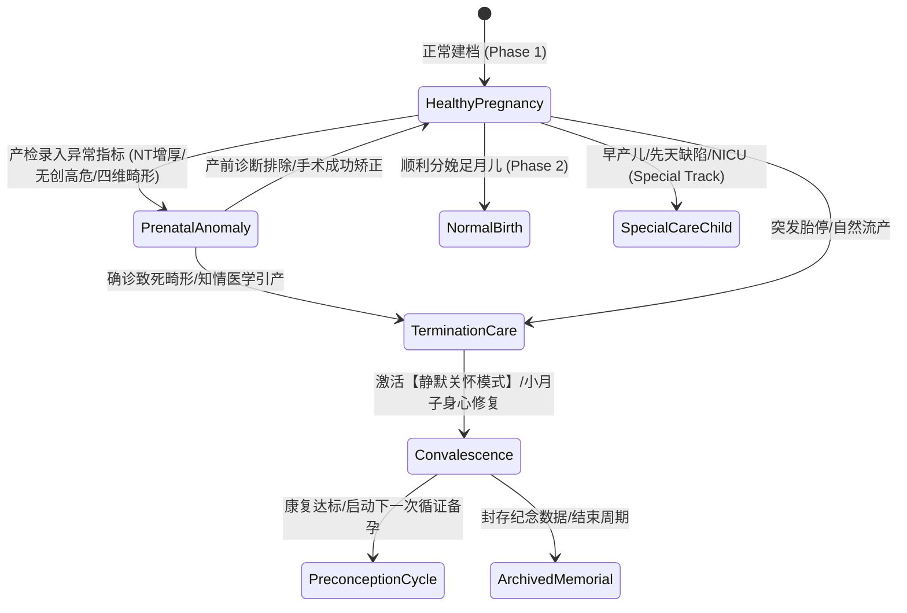

# 24Years 异常妊娠、终止关怀与特殊儿童照护体系 (Compassionate Care & Special Needs Architecture)

> **设计宗旨**：生命孕育充满不确定性。本体系专为孕期筛查异常、胚胎停育/意外流产/引产，以及出生后伴有先天性缺陷、早产或慢病的家庭设立。  
> **核心伦理准则**：**杜绝二次创伤 (Zero Retraumatization)、100% 现代循证医学 (EBM Only)、长效关怀与隐私主权 (Dignity & Privacy)**。

---

## 一、 场景分流总览 (Scenario Routing)

---

## 二、 路径 A：孕期产前筛查异常与 MDT 协同 (Prenatal Anomalies)

### 1. 典型异常指标触发矩阵

| 筛查项目 | 异常阈值 / 表现 | 系统第一响应机制 | 现代循证医学 (EBM) 决策向导 |
| :--- | :--- | :--- | :--- |
| **孕 11~13+6 周 NT 超声** | $NT \ge 3.0	ext{mm}$ (或 $\ge 99$ 百分位) | 自动解除警报红字，出具《NT 增厚科学解码手册》 | 告知：NT 增厚不等于畸形，约 70% 胎儿核型正常。建议进行绒毛活检 (CVS) 或 16 周羊穿 + 胎儿超声心动图。 |
| **中期血清唐筛 / NIPT** | 21/18-三体高风险，或无创 DNA 提示异常 | 阻断恐慌，推荐定点产前诊断机构 | **EBM 铁律**：筛查性质手段严禁直接作为引产依据！必须且仅能以羊膜腔穿刺核型分析 + SNP-array（微阵列）作为金标准。 |
| **四维超声结构排畸** | 检出器官结构异常（如心内结构、肾盂分离、唇腭裂等） | 启动异常分级与 MDT 协同面板 | 区分**可手术矫正型**（如单纯唇腭裂、室间隔缺损）与**严重不可逆型**（如严重脑发育不全、双肾缺如）。 |

### 2. 产前诊断决策树与 MDT 专病档案
- **可手术矫正通道**：
  - 自动切换为“产前产后一体化追踪模式”；
  - 提供定点三甲儿童医院心脏外科、小儿外科会诊备忘录，产前提前锁定新生儿转运 ICU 资源与产后即刻救治预案。
- **不可逆严重缺陷**：
  - 严格根据《中华人民共和国母婴保健法》及临床指南，提供具备资质的省市级母婴保健医学技术鉴定机构就诊指引，进入路径 B。

---

## 三、 路径 B：终止妊娠与【静默关怀模式】(Silent Compassionate Mode)

### 1. 为什么必须设立“静默关怀模式”？
99% 的商业母婴 App 的设计灾难在于：当用户不幸流产或引产后，App 仍会因后台定时任务不断推送“宝宝今天长睫毛啦”、“准备买婴儿推车了吗”。这是对产妇家庭极其残忍的二次心理创伤。

### 2. 极速阻断与状态重置流 (Zero Retraumatization Flow)

### 3. 小月子母体身心康复专区功能架构

1. **生理康复全天候监测**：
   - **恶露/阴道出血监测**：记录出血量与色泽；若出血超过月经量、持续超过 2 周或伴有大血块，触发红色就诊预警；
   - **感染与体温防线**：每日早晚体温打卡，体温 $>37.5^\circ	ext{C}$ 或伴有下腹剧痛，立即提示急性子宫内膜炎或盆腔感染风险，附带急诊指南；
   - **hCG 转阴追踪**：流产后每周测定血/尿 hCG，直到彻底降至正常（$<5	ext{ mIU/mL}$），排除妊娠滋养细胞疾病（如葡萄胎残留）；
   - **超声复查日历**：术后 2~4 周自动设立“宫腔超声复查”提醒，排查是否有宫腔残留与宫腔粘连。
2. **现代循证医学“小月子”康复指南（拒绝陈规陋习与中药偏方）**：
   - 彻底摒弃“不洗头、不洗澡、吃生化汤中药、捂汗”等不科学民间偏方；
   - 指导高蛋白平衡饮食、温水淋浴清洁、避免盆浴与性生活 1 个月、科学避孕（建议至少修复 3~6 个月后再备孕）。
3. **心理哀伤干预与创伤辅导 (Perinatal Bereavement Support)**：
   - 引入国际围产期哀伤辅导框架，普及“库伯勒-罗丝悲伤五阶段（否认-愤怒-协商-抑郁-接受）”；
   - 提供夫妻双向支持指南：指导准爸爸如何分担家务、倾听情绪，避免说出“你还年轻以后还能生”等让产妇感到自责的话语；
   - 集成 EPDS（爱丁堡抑郁量表），流产后第 2 周、第 4 周进行主动心理健康度自测，必要时提供全国心理危机干预热线通道。
4. **循证病因深度排查向导 (Etiology Investigation)**：
   - 破除产妇自责心理：“早期自然流产中 50%~60% 为胚胎自身染色体非整倍体异常，是自然选择优胜劣汰，并非因为你吃了某种食物或走动太多”；
   - 若发生 **2 次及以上复发性生化/流产 (RPL)**，系统出具《复发性流产循证医学排查全景树》：
     - ① 双方染色体核型检查（平衡易位/罗氏易位）；
     - ② 抗磷脂综合征 (APS) 抗体谱（狼疮抗凝物、抗心磷脂抗体、抗 $eta_2$-糖蛋白1抗体）；
     - ③ 解剖结构（子宫纵隔、宫腔粘连三维超声/宫腔镜）；
     - ④ 内分泌（黄体功能、甲状腺 TSH、糖化血红蛋白）。
5. **历史数据加密封存箱 (Memorial Vault)**：
   - 系统绝不强制抹除用户过去的产检心血，而是将其自动封存于“纪念时光箱”；
   - 从日常主界面完全隐匿，仅在用户主动输入独立安全密码后方可解封查看，尊重父母对每一个生命的怀念与记忆主权。

---

## 四、 路径 C：特殊儿童与长期照护体系 (Postnatal Special Needs & Care)

当宝宝出生后确诊为早产儿、罕见病或先天性长期慢性健康状况时，App 切换为长期关怀工作台：

### 1. 早产儿自适应纠正月龄引擎 (Corrected Age Engine)

- **核心算法**：
  $$	ext{纠正月龄} = 	ext{实际出生月龄} - rac{40 - 	ext{出生孕周}}{4}$$
- **专业曲线支持**：
  - 自动禁用普通足月儿 WHO 生长曲线；
  - 全面引入 **Fenton 早产儿生长曲线**（覆盖 24~50 孕周）与 **INTERGROWTH-21st 模型**；
  - 矫正月龄至 2 周岁（身长/头围）或 3 周岁（神经心理发育），消除不科学对照带来的焦虑。

### 2. 专病照护、用药与随访管理中枢

1. **儿科高精度用药核对器**：
   - 针对特殊患儿（如先天性甲状腺功能减低、癫痫、支气管肺发育不良），建立严格基于**每日体重公斤数计算器**（如：mg/kg/day）；
   - 双亲签名防漏服核对机制，支持多监护人（父母/保姆）同步交接用药日志。
2. **康复训练 (PT / OT / ST) 随访日历**：
   - 大运动（PT）、精细动作（OT）、语言康复（ST）训练打卡器；
   - 支持上传康复前后视频对照流，便于定期向主治康复医师展示训练进展。

### 3. 大病特病医疗账务与救助支持

1. **多层级医疗账单透视**：
   - 拆解医保统筹基金支付、大病保险二次报销、商业健康险理赔、残联儿童康复救助补贴与家庭自付；
2. **政策与特病绿色通道**：
   - 依据国家卫健委《罕见病目录》，提供地方门诊慢特病认定流程与特药双通道药房指引。

### 4. 长期照护者防倦怠监测 (Caregiver Burnout Prevention)

- 长期照护特殊儿童极易导致父母“照护者倦怠综合征 (Caregiver Burnout)”；
- 系统引入 Zarit 照料者负担量表，每季度评估主要监护人心理负荷；
- 设立“家庭轮换强制休息提醒”：提示父母“照顾好自己才能更好地守护孩子”。

---

## 五、 状态机流转与工程技术设计

---

## 六、 变更与审核记录

| 版本 | 日期 | 编制人 | 核心变更内容 |
| :--- | :--- | :--- | :--- |
| **v1.0.0** | 2026-09-14 | Antigravity AI & Product Owner | 正式建立异常妊娠、终止关怀与特殊儿童照护全流程体系规范；制定【静默关怀模式】零容忍推送阻断机制、小月子现代医学身心康复向导、复发性流产循证排查树与早产儿纠正月龄 Fenton 引擎。 |
