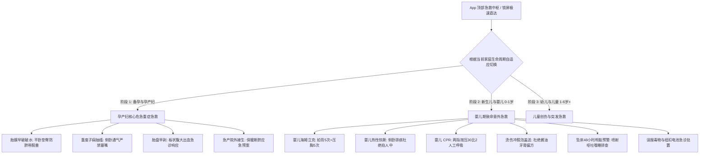
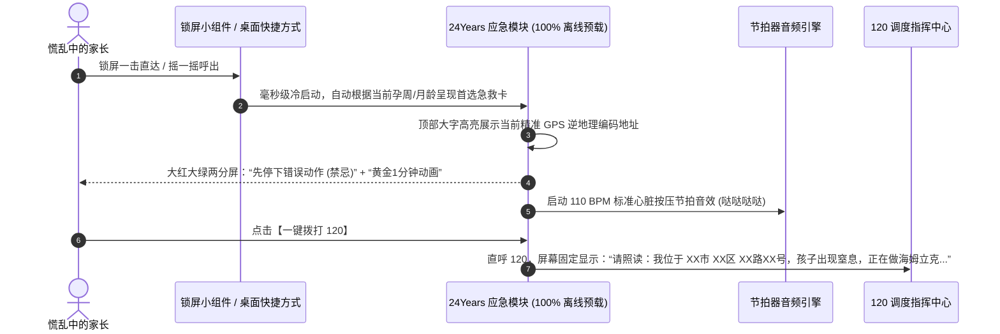

# 24Years 全生命周期家庭分阶应急急救体系 (Adaptive Family Emergency & Critical Care)

> **设计宗旨**：家庭在不同生命阶段所面临的致命风险与急症类型截然不同。本体系提供**分阶段自适应急救向导**，涵盖孕产期母胎危急重症与婴幼儿核心意外急救。  
> **黄金法则**：**防慌乱 (Panic-Proof)、离线秒开 (Offline-First)、严惩民间有害偏方 (EBM Only)、120 地理位置一键精准报读**。

---

## 一、 急救系统全局架构与自适应切换



---

## 二、 阶段一：孕产妇核心危急重症急救指南 (Pregnancy Critical Care)

### 1. 胎膜早破 (破水) 急救 SOP

- **体征识别**：无意识温热液体大量自阴道涌出，湿透内裤，不受自主神经控制。
- **黄金 1 分钟自救动作**：
  1. **立刻就地平卧，并垫高臀部（头低臀高位）**；
  2. 严禁站立走动！严禁洗澡！
  3. 立即呼叫 120，家属准备好产检病历夹与待产包。
- **现代医学原理解读**：
  - 胎头未完全入盆前破水，站立会使羊水快速排空，导致**胎儿脐带随羊水脱出至宫颈口外（脐带脱垂）**，宫缩压迫脐带将直接切断胎儿血液供应，几分钟内即可导致窒息死亡。

### 2. 重度子痫前期与子痫抽搐发作

- **体征识别**：孕晚期血压 $\ge 160/110	ext{ mmHg}$，突发全身肌肉强直抽搐、双眼上翻、牙关紧闭、口吐白沫、神志不清。
- **标准救命操作**：
  1. **解开衣扣，立即让产妇头偏向一侧（取侧卧位）**；
  2. 迅速清理口腔分泌物，保持气道绝对通畅；
  3. 移开周围坚硬锐利物体，防止磕碰外伤；
  4. 立即拨打 120，明确告知“孕妇子痫抽搐，需吸氧与硫酸镁解痉抢救”。
- **🚫 绝对禁忌（民间害人陋习黑名单）**：
  - **严禁强行按压产妇抽搐肢体**（极易造成骨折与肌腱撕裂）；
  - **严禁往产妇嘴里硬塞毛巾、勺子或手指**（产妇抽搐不会咬断舌头，塞物极易造成牙齿脱落坠入气道窒息）；
  - **严禁掐人中、放血**（现代医学证实完全无效且延误抢救）。

### 3. 胎盘早剥与急产处置

- **胎盘早剥**：
  - 孕晚期突发持续性撕裂样腹痛，子宫变硬如板状且无间歇性放松，可伴有鲜红或暗红阴道出血；
  - 处置：绝对卧床静卧，切忌按压揉腹，一键呼叫 120 说明“疑似胎盘早剥，产房准备紧急剖宫产”。
- **院外急产（救护车未到达前胎头已娩出）**：
  - 指导产妇张口哈气（不要屏气用力）；双手轻托胎头，保护会阴防撕裂；
  - 婴儿娩出后切忌倒提拍打脚底，立即用干净干燥毛巾包裹保暖，清理口鼻羊水；
  - 脐带无需盲目剪断（未消毒剪刀会导致新生儿破伤风），保持胎盘与婴儿处于同一水平面，等待救护人员。

---

## 三、 阶段二：婴儿期（0~1岁）致命意外急救指南 (Infant Critical Care)

### 1. 婴儿气道异物梗阻——【婴儿海姆立克急救法】

```
【适用年龄】：0 ~ 1 岁婴儿（黄金抢救时间仅 4 分钟！）
【典型体征】：进食或玩耍中突发面色发紫、无法哭泣、无声挣扎、吸气性三凹征

  步骤 1：拍背 5 次 (Back Blows)
  ────────────────────────────
  - 骑跨在前臂上，手托住婴儿下颌骨
  - 保持【头低脚高位】（倾斜 30°~45°）
  - 用另一手掌根在两肩胛骨之间用力叩击 5 次

  步骤 2：压胸 5 次 (Chest Thrusts)
  ────────────────────────────
  - 将婴儿翻转至仰卧位，仍保持【头低脚高】
  - 用食指与中指在两乳头连线中下段按压 5 次（深约 4cm）

  步骤 3：循环与评估
  ────────────────────────────
  - 重复循环，直到异物咳出
  - 若失去意识，立即放平启动【婴儿 CPR 心肺复苏】

  🚫 绝对禁忌：严禁竖抱拍背！严禁盲目用手指在喉咙深处乱抠盲掏！
```

### 2. 婴儿热性惊厥（高热抽搐口吐白沫）

- **流行病学与预后**：多见于 6 个月~3 岁儿童，绝大多数单纯性热性惊厥在 1~3 分钟内自行停止，**不会烧坏大脑，极少留下神经系统后遗症**。
- **标准救命 SOP**：
  1. **就地安全侧卧**：放平在安全床面或地垫，头偏向一侧，保证唾液分泌物流出，防止误吸；
  2. **松解衣被散热**：解开领口，保持室内凉爽通风；
  3. **手机录像与掐表**：记录发作起始时间、持续秒数、四肢是否对称抽动，就医时供儿科医生研判。
- **🚫 严厉打击的伪科学偏方**：
  - ❌ **掐人中/合谷穴**：毫无止抽作用，只会造成局部组织深度缺血坏死与感染；
  - ❌ **塞毛巾/筷子/手指入嘴**：造成机械性气道梗阻或牙齿折断；
  - ❌ **强行灌服退烧药/灌水**：抽搐时吞咽反射消失，液体直接呛入气管导致吸入性肺炎窒息；
  - ❌ **酒精擦浴**：婴儿体表面积大，经皮吸收可导致急性中毒昏迷。

### 3. 婴儿心肺复苏术 (Infant CPR)

| 项目 | 标准规范参数 (AHA / 中华医学会儿科分会) |
| :--- | :--- |
| **施救对象** | 0~1 岁失去意识、无呼吸或仅有濒死喘息的婴儿 |
| **按压位置** | 两乳头连线正下方（胸骨下半段） |
| **按压手法** | 单人采用**两指垂直按压法**（食指+中指）；双人采用双拇指环抱按压法 |
| **按压深度** | 约 $4	ext{cm}$（胸廓前后径的 $1/3$），每次按压后确保胸廓完全回弹 |
| **按压频率** | **100 ~ 120 次/分钟**（App 提供标准节拍器音频 Metronome） |
| **按压/通气比**| 单人施救 **30:2**（30次胸外按压 + 2次口对口鼻人工呼吸，每次轻吹 1 秒见胸廓隆起） |

### 4. 烫伤急救——【五字诀：冲-脱-泡-盖-送】

1. **冲（Cool）**：立即用 $15\sim20^\circ	ext{C}$ 的清洁流动自来水轻柔冲洗创面 **15~20 分钟**，迅速降低皮下深层余温；
2. **脱（Remove）**：在水中小心用剪刀剪开去除伤口周围衣物，**严禁强行生拉硬扯**粘连衣物；
3. **泡（Soak）**：在冷水中继续浸泡 10~15 分钟缓解剧痛（若大面积烫伤应避免体温过低）；
4. **盖（Cover）**：用无菌生理盐水纱布或洁净保鲜膜松松覆盖保护伤口，切勿抓破水疱；
5. **送（Transport）**：立刻送往具备儿科烧伤诊疗资质的三甲医院。
- **🚫 绝命偏方黑名单**：严禁涂抹**酱油、牙膏、食盐、麻油、草木灰、紫药水、红药水**。

### 5. 坠床磕碰——48小时颅脑损伤警报监测树

- **现场评估**：坠床后不要盲目立即抱起剧烈摇晃！先就地观察 10 秒孩子肢体活动；
- **48 小时极危警报（出现任意一项立即就医儿外科）**：
  - ① 连续剧烈喷射性呕吐 $\ge 2$ 次；
  - ② 意识改变：极度嗜睡难唤醒、眼神呆滞空洞、两侧瞳孔大小不一；
  - ③ 耳道或鼻腔持续流出淡血水或清亮透明液体（颅底骨折脑脊液漏）；
  - ④ 婴儿前囟门明显鼓胀紧绷、肢体无力或抽搐。

### 6. 误服毒物与纽扣电池

- **纽扣电池（最高危急症）**：
  - 误吞纽扣电池接触湿润食道黏膜可在 **2 小时内产生强电流与碱性烧伤，导致食道穿孔坏死**！
  - 处置：**严禁催吐！**立刻送急诊行紧急胃镜取出；若孩子 $>1$ 岁且无吞咽困难，就医路上每隔 10 分钟可喂 10ml 纯蜂蜜（缓解组织腐蚀）。
- **强酸强碱腐蚀剂（如洁厕灵、管道疏通剂）**：
  - **严禁催吐！**催吐会导致食道二次严重烧伤；严禁强行酸碱中和。立刻就医。

---

## 四、 阶段三：幼儿及学龄儿童（1~6岁+）核心急救 (Child Critical Care)

1. **幼儿/儿童海姆立克法（$>1$ 岁）**：
   - 施救者跪在孩子身后，一手握拳拇指侧抵住肚脐上方两横指处，另一手包住拳头，向内上方快速冲击。
2. **儿童溺水救治**：
   - 出水后立即清理口鼻泥沙，判断呼吸意识；**严禁倒背倒吊控水！**控水不仅控不出肺内水分，还会导致胃内容物反流窒息。无呼吸立即原地启动 CPR。
3. **鼻出血科学压迫**：
   - 身体前倾微低头（**严禁仰头**，仰头会导致血液咽入胃部引起恶心呕吐）；用手指捏紧两侧鼻翼 10~15 分钟，冰敷额头。

---

## 五、 移动端应激人机工程与交互技术实现



1. **极致防慌乱 UI**：
   - 界面全黑背景，采用极高对比度大色块；
   - 字体加大至 24pt 以上，步骤仅限 3 步以内的短动图与粗体文字。
2. **完全离线运行能力**：
   - 所有急救图解、视频矢量动画、节拍器音频（110 BPM）、自检问卷，**随 App 宿主壳初次安装时 100% 固化在本地只读包中**，杜绝现场因电梯间、地下室无网络无法加载的隐患。
3. **120 地址照读辅助卡**：
   - 整合 GPS 定位并本地缓存最近一次逆地理编码，确保慌乱哭泣的家长看着屏幕就能直接读出救援地址。

---

## 六、 变更与审核记录

| 版本 | 日期 | 编制人 | 核心变更内容 |
| :--- | :--- | :--- | :--- |
| **v1.0.0** | 2026-09-14 | Antigravity AI & Product Owner | 正式建立全生命周期分阶自适应家庭应急急救体系；覆盖破水、子痫、胎盘早剥、婴儿海姆立克、热性惊厥、婴儿 CPR、烫伤五字诀与纽扣电池误服；设立离线秒开、120 照读卡与节拍器技术规范。 |
