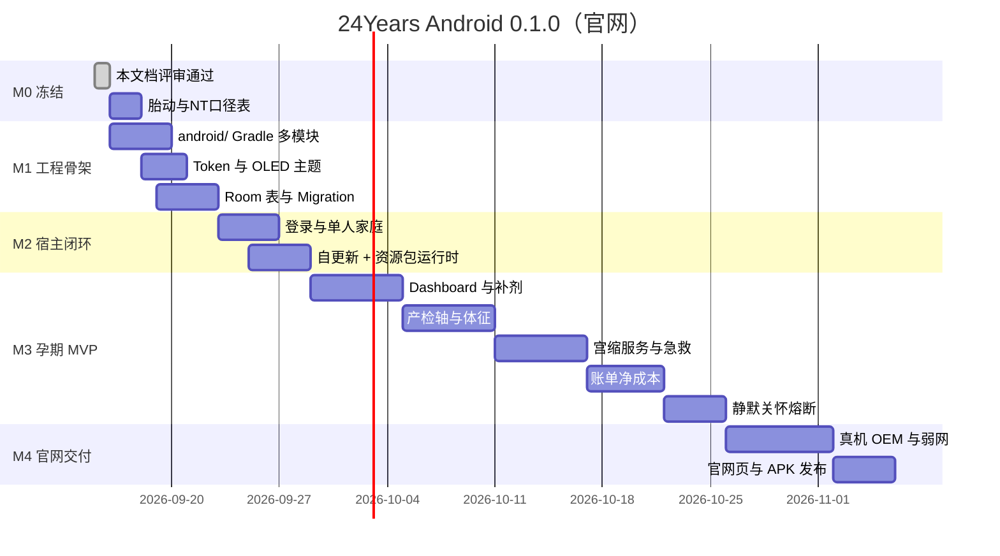

# 08 Android 官网分发技术实施计划

> **文档性质**：工程实施冻结稿（取代 `03` 中的 Uni-app / 三端 / WGT 热更选型）  
> **当前版本**：v0.1.0  
> **冻结日期**：2026-09-15  
> **适用分支**：`base0.1.0`  
> **范围**：仅 Android，官网侧载，性能优先  
> **关联文档**：产品口径仍以 [00 总纲](./00_项目全景需求与全流程梳理总纲.md)、[01 PRD](./01_产品需求规格说明书_PRD.md) 为准；视觉以 [05](./05_UI视觉风格与设计系统规范.md) 为准

---

## 一、决策冻结（不可在实现中回摆）

| # | 决策 | 冻结结论 |
| :--- | :--- | :--- |
| D1 | 端 | **只做 Android**。iOS / 微信小程序不进本阶段仓库。 |
| D2 | 性能 | **Kotlin + Jetpack Compose 原生**。不采用 Uni-app、Flutter、RN。 |
| D3 | 分发 | **不上架应用商店**。官网 HTTPS 下载 APK，应用内自更新。 |
| D4 | 模块化 | 代码用 Gradle 多模块；运行时分三层：**宿主代码 / 资源包 / 代码 split（后期）**。 |
| D5 | 动态代码 | **禁止** 从 `files/` 等可写目录 `DexClassLoader` 加载。Android 14 会直接失败。 |
| D6 | MVP 安装包 | **单体 APK**：宿主 + 孕期 UI + 急救 + 宫缩。备孕 / 0–1 岁代码不进 0.1.0。 |
| D7 | 数据 | 卸载任何模块都不得删除 Room 中的家庭、账单、体征、产检。 |
| D8 | 急救 | SOP 正文与宫缩前台服务打进宿主，**禁止按需下载**。 |

`03` 文档保留为产品向模块化愿景。**本文件是 Android 工程的唯一实施源。** 与 `03` 冲突时以本文为准。

---

## 二、目标与非目标

### 1. 本阶段目标

1. 官网可下载、可安装、可自更新的 Android App。  
2. 跑通孕期最小闭环（见第三节）。  
3. 离线可记体征 / 账单 / 宫缩；有网再同步。  
4. 资源包（词典、食谱、音频）可从 OSS 下载与清理。  
5. 留下 `ModuleRuntime` 接口，阶段代码 split 不在 0.1.0 启用。

### 2. 明确不做（0.1.0）

- iOS、小程序、鸿蒙独立端  
- Uni-app WGT / Flutter deferred component  
- 化验单 OCR、B 超百分位曲线引擎  
- 孕肚 Ghost Overlay、胎心留声机、凯格尔振动（原生能力预留接口，不实现）  
- Live Activity（iOS 专有）；Android 用通知 + Glance 小组件，小组件可放到 0.2.0  
- 31 省产假精算、起名盲选、分娩计划书 PDF  
- 备孕模块、0–1 岁模块  
- 插件化热加载、热修复  
- Google Play Feature Delivery

---

## 三、MVP 产品范围（工程裁剪）

只实现能验证产品的 6 条闭环。PRD 其余功能全部降级为后续 feature 模块。

| 闭环 | 必须有 | 0.1.0 做法 |
| :--- | :--- | :--- |
| 家庭账号 | 手机号登录、单人建档、邀请码升双人 | 云端家庭 ID；无伴侣则 UI 裁切督促入口 |
| 产检 + 体征 | 按 LMP 生成产检轴；血压 / 体重 / 胎动手工录入 | 无 OCR；异常出红条，不自动诊断 |
| 补剂时钟 | 叶酸 / 铁 / 钙默认模板 + 自建提醒 | 本地闹钟 + WorkManager；铁钙错开 2 小时写死在模板 |
| 5-1-1 宫缩 + 急救卡 | 大按钮计时、达标通知、破水平卧文案、一键拨号 | `ForegroundService`；急救页离线 |
| 账单净成本 | 手工记账 + 产检金额一键入账；医保 / 津贴冲抵 | 无发票云识别 |
| 静默关怀 | 一键终止妊娠 → 停掉孕周倒计时与正向推送 | 首页切康复占位；封存入口；小月子完整专区可 0.2.0 |

医学文案第一版只内置：血压红线、破水指引、5-1-1 法则、急救卡字段。所有医疗页必须有免责声明。

**编码前必须另表冻结（不在本文改算法）：**

- 胎动：总纲「2 小时 ≥ 10 次」与 PRD「12 小时计数」冲突  
- NT：PRD 2.5 mm 与 `06` 文档 3.0 mm 冲突  

未冻结前，App **只展示用户录入值，不做阈值着色**，避免做错预警。

---

## 四、技术栈冻结

| 层 | 选型 |
| :--- | :--- |
| 语言 / UI | Kotlin 2.x，Jetpack Compose，Material3 定制 Token（对齐 `05`，不直接用粉红默认主题） |
| 架构 | 参考 Now in Android：`app` + `core-*` + `feature-*`；单向数据流（State / Event） |
| DI | Hilt |
| 异步 | Coroutines + Flow |
| 本地库 | Room（SQLite） |
| 偏好 | DataStore |
| 网络 | OkHttp + Kotlin Serialization |
| 后台 | WorkManager |
| 导航 | Navigation Compose |
| 图片 | Coil |
| 相机（预留） | CameraX，0.1.0 不接页面 |
| 推送 | 个推或极光 + 厂商通道；不依赖 FCM / GMS |
| 最低系统 | **minSdk 26**（Android 8，通知渠道 / 前台服务） |
| 目标系统 | targetSdk 以发布时最新稳定版为准（预计 35/36） |
| ABI | 官网提供 `arm64-v8a` 主包；可选 `armeabi-v7a`。不做 x86。 |
| 混淆 | R8 开启；签名用独立 upload keystore，不进 Git |

后端 0.1.0 只做薄 API（见第十一节），语言不锁死；若希望与客户端同语言，优先 Ktor。对象存储用任意 S3 兼容 OSS。

---

## 五、工程目录

仓库内 Android 工程放在 `android/`，与 `docs/` 并列，避免文档和 Gradle 根冲突。

```text
24years/
  docs/                          已有产品文档
  android/
    settings.gradle.kts
    gradle/libs.versions.toml
    app/                         宿主：Application、导航、急救入口、宫缩 Service、自更新
    core:common/
    core:model/                  纯 Kotlin 数据模型，无 Android 依赖
    core:database/               Room Entity / DAO / Migration
    core:datastore/
    core:network/                API DTO、Retrofit/OkHttp
    core:sync/                   离线队列、冲突 Last-Write-Wins
    core:ui/                     设计 Token、通用组件、OLED 主题
    core:domain/                 状态机、净成本公式、补剂错开规则
    core:updater/                版本清单、下载、签名校验、PackageInstaller
    core:module-runtime/         ModuleRuntime 接口；0.1.0 实现 = AlwaysInstalled
    core:push/
    feature:auth/
    feature:onboarding/          LMP / 预产期 / 单人双人
    feature:home/                孕期 Dashboard
    feature:checkup/             产检轴与录入
    feature:vitals/              血压体重胎动
    feature:reminders/           补剂与自建任务
    feature:ledger/              账单与净成本
    feature:emergency/           急救卡 + SOP（也可源码放 app，但 API 边界仍独立）
    feature:contraction/         5-1-1
    feature:silent-care/         静默开关与熔断
    feature:content/             资源包：能不能吃 / 食谱（无包则空态）
```

规则：

- `feature:*` 不得互相依赖；只依赖 `core:*`。  
- `app` 组装导航与 Hilt 模块。  
- 0.2.0 若拆代码 split，把 `feature:checkup` 等打成 `com.android.dynamic-feature` 或独立 split APK，**不改 Room schema 归属**。

---

## 六、分发与模块化

### 1. 三层模型

```text
┌─────────────────────────────────────────────┐
│ A. 宿主 APK（官网下载）                       │
│    登录、家庭、Room、同步、急救、宫缩、孕期UI  │
├─────────────────────────────────────────────┤
│ B. 资源包 ContentPack（OSS，无安装框）        │
│    JSON / 图片 / 音频；可随时删               │
├─────────────────────────────────────────────┤
│ C. 代码 split（0.2.0+，PackageInstaller）    │
│    备孕 / 婴儿 UI；同包名同签名同 versionCode │
└─────────────────────────────────────────────┘
```

0.1.0 只交付 **A + B**。C 的接口先写死为「已安装 / 未实现卸载」。

### 2. 官网安装包

| 文件 | 说明 |
| :--- | :--- |
| `24years-0.1.0-arm64-v8a.apk` | 主推 |
| `24years-0.1.0-armeabi-v7a.apk` | 可选 |
| `SHA256SUMS.txt` | 官网展示，客户端更新也用同一套哈希 |

单 APK，不向用户提供 `.apks` / `.xapk`。系统文件管理器装 split 包失败率高。

网页需写清：允许未知来源 → 下载 → 安装。针对小米 / 华为 / OPPO / vivo 各附一张拦截处理说明（可后补）。

### 3. 资源包清单（OSS）

```text
https://cdn.example.com/24years/content/
  manifest.json
  food-checker/2026-09-15.json
  food-checker/2026-09-15.json.sha256
  recipes/pregnancy-week-24.json
  audio/   （0.1.0 可空）
```

`manifest.json` 示例：

```json
{
  "minAppVersionCode": 1,
  "packs": [
    {
      "id": "food-checker",
      "version": "2026.09.15",
      "url": "https://cdn.example.com/24years/content/food-checker/2026-09-15.json",
      "sha256": "…",
      "sizeBytes": 128000
    }
  ]
}
```

下载到 `context.filesDir/content/{id}/`，校验 SHA-256 后再原子替换。失败则保留旧包。清理资源不碰数据库。

### 4. 代码 split（仅接口，0.1.0 不启用）

```kotlin
enum class FeatureModuleId { PRECONCEPTION, PREGNANCY, INFANT_0_1 }

interface ModuleRuntime {
    fun isInstalled(id: FeatureModuleId): Boolean
    fun isAlwaysOn(id: FeatureModuleId): Boolean
    suspend fun install(id: FeatureModuleId): Result<Unit>
    suspend fun uninstall(id: FeatureModuleId): Result<Unit>
}
```

0.1.0 实现：

- `PREGNANCY`：`isAlwaysOn = true`  
- 其余：`isInstalled = false`，`install` 返回 `NotImplemented`

0.2.0 实现要点：

- split 与 base **相同** `applicationId`、签名、`versionCode`  
- `PackageInstaller.SessionParams.MODE_INHERIT_EXISTING`  
- 安装前校验 APK 签名证书与当前包一致  
- UI 必须提示「系统将弹出安装确认，应用可能重启」  
- 不得静默安装（无设备管理员权限）

---

## 七、宿主内置 vs 可下载

| 能力 | 位置 | 原因 |
| :--- | :--- | :--- |
| 登录 / 配对 / 同步 | 宿主 | 内核 |
| Room 全表 | 宿主 | 数据永留 |
| 急救 SOP + 急救卡 | 宿主 | 离线秒开 |
| 宫缩 ForegroundService | 宿主 | 熄屏计时 |
| 孕期 Dashboard / 产检 / 体征 / 补剂 / 账单 / 静默开关 | 宿主（0.1.0） | MVP 验证闭环 |
| 能不能吃词库、食谱 JSON | 资源包 | 体积与更新频率 |
| 备孕 UI、婴儿 UI | 未来 split | 降低首包，0.1.0 不做 |
| 胎教音频 | 资源包 | 可删 |

体积目标：arm64 首包 **≤ 15MB**（无大量音频）。超标先砍预置图，不砍急救。

---

## 八、数据层

### 1. 原则

- Offline-First：先写 Room，再入同步队列。  
- 冲突：Last-Write-Wins（`updatedAt`）。账单保留 `expense_revisions` 最低 30 条。  
- 家庭是租户：所有业务表带 `family_id`。  
- 静默模式是家庭状态，不是删库。

### 2. 0.1.0 表（相对 `03` ER 的最小集）

必须有：

- `families`：`family_id`, `family_mode`, `current_stage`, `lmp_or_due_date`, `care_state`（`healthy` / `silent`）  
- `users`：`user_id`, `family_id`, `role`, `phone`  
- `checkups`：产检节点与录入（`03` 原稿缺失，这里补上）  
- `maternal_vitals`  
- `contraction_logs`  
- `reminders` + `reminder_completions`  
- `expenses`  
- `emergency_medical_info`  
- `sync_queue`  
- `content_packs`（本地已装资源包版本）

明确推迟：BBT、起名、分娩计划、延时摄影、EPDS 全量表结构（静默模式可先只留开关与时间戳）。

Migration 用 Room `AutoMigration` 或手写 `Migration_1_2`，禁止破坏性清库。

### 3. 同步

- 接口形态：`POST /v1/sync` 上传变更，`GET /v1/sync?since=` 拉取。  
- 设备时钟不可信，以服务端 `serverTime` 校正。  
- 0.1.0 允许「单设备先能用、双人同步可稍后接」：登录后本地可完整使用；同步失败只横幅提示，不阻断记账和宫缩。

---

## 九、关键原生能力

| 功能 | 实现 | 0.1.0 |
| :--- | :--- | :--- |
| 宫缩计时 | `ForegroundService` + 常驻通知；时间轴用 `SystemClock.elapsedRealtime()`，**禁止** `delay` 累加当权威时钟 | 必须 |
| 达标提醒 | 通知；可选 `AlarmManager.setAlarmClock` | 必须 |
| 破水 / 急救 | 宿主 Activity，拨号 `ACTION_DIAL`（不直接 `CALL`，少要电话权限） | 必须 |
| 补剂 | WorkManager + 精确闹钟（用户关电池优化引导） | 必须 |
| 桌面小组件 | Glance：孕周 / 补剂 | **0.2.0** |
| 相机叠加 | CameraX 预留 | 不做 |
| 震动节律 | `VibratorManager` 预留 | 不做 |
| OLED | Compose 主题 `#000000` | 必须，跟随系统夜间或应用内开关 |

宫缩服务在用户点「开始监测」后启动；停止监测或进程被杀后，已记录的 `contraction_logs` 必须已落库。

厂商杀后台：文档化「自启动 / 无限制电池」引导，不做 root、不做保活黑科技。

---

## 十、自更新与签名

### 1. 版本清单

`GET https://cdn.example.com/24years/app/latest.json`

```json
{
  "versionCode": 2,
  "versionName": "0.1.1",
  "minSdk": 26,
  "forceUpdate": false,
  "releaseNotes": "修复宫缩计时在熄屏后漂移",
  "apks": [
    {
      "abi": "arm64-v8a",
      "url": "https://cdn.example.com/24years/app/2/24years-0.1.1-arm64-v8a.apk",
      "sha256": "…",
      "sizeBytes": 9800000
    }
  ]
}
```

流程：比对 `versionCode` → 下载到 cache → SHA-256 → 校验 APK 签名与当前 `signingInfo` 一致 → `PackageInstaller` 全量安装 → 用户确认。

### 2. 密钥

- 本地 `keystore/` **加入 `.gitignore`**  
- 另存离线备份；丢失则所有已装用户无法覆盖更新  
- CI 用密钥托管，不写进仓库

### 3. 权限

自更新需要「安装未知应用」权限（指向 24Years 自己）。首次更新前出说明页。

---

## 十一、后端最小集（0.1.0）

| 接口 | 作用 |
| :--- | :--- |
| `POST /v1/auth/otp/send` `POST /v1/auth/otp/verify` | 登录，发 JWT |
| `POST /v1/families` `POST /v1/families/join` | 建家 / 6 位邀请码 |
| `GET|POST /v1/sync` | 增量同步（可第二迭代） |
| 静态 `latest.json` + content manifest | 可只放 OSS，不必走应用服务器 |

0.1.0 允许 **无同步也能完成验收**（单机闭环）。双人同频作为 0.1.x 的加分项，不挡官网首发。

---

## 十二、安全、合规、OEM

1. **免责**：首次启动与急救/血压页固定展示「不替代执业医师」。  
2. **隐私**：隐私政策 URL 进设置；健康数据默认仅本机，开启同步前二次确认。  
3. **传输**：全站 HTTPS；证书校验，禁止明文 API。  
4. **日志**：禁止把血压、孕周、姓名打进明文崩溃日志。  
5. **国内运营**：面向中国用户即使不上架，仍评估 APP 备案与隐私政策；医疗文案需有审稿人（流程，不在本仓库实现）。  
6. **侧载政策**：2026-09-30 起 Google 在部分国家对侧载做开发者实名。架构不依赖「永远随便装」；预留更换签名与包名的成本说明。  
7. **OEM**：安装与推送在小米 / 华为各测一款；记入发布检查单。

---

## 十三、实施里程碑

本计划取代总纲中「Uni-app 脚手架 / iOS / 小程序上线」那段甘特。



人员未定时按单线程估算；有两人可将 M2 与 M3 部分并行。

---

## 十四、0.1.0 验收标准

1. 未上架，从官网下载 arm64 APK，在未预装 Play 的设备上能装开。  
2. 冷启动到首页可交互，中端机（如骁龙 7 系四年内机型）可接受，无 WebView 白屏。  
3. 飞行模式可：记血压、记账、跑完一组宫缩并落库。  
4. 打开急救页不依赖任何 OSS 资源包。  
5. 宫缩页进后台 + 熄屏 10 分钟，计时误差不超过 1 秒（以 `elapsedRealtime` 为准）。  
6. 点静默关怀后，首页不再出现预产期倒计时与待产正向文案；历史产检仍可从封存入口进入。  
7. 资源包下载失败时，「能不能吃」显示空态，不崩溃。  
8. 自更新校验错误哈希或错误签名时拒绝安装。  
9. 首包体积 arm64 ≤ 15MB。  
10. 卸载 App 后数据随系统清除；不提供桌面残留插件。

---

## 十五、下一步立刻做的事

1. ~~初始化 `android/` Gradle 骨架与空 `ModuleRuntime`。~~ 已落在仓库 `android/`（`base0.1.0`）。  
2. 本机安装 Android SDK（compileSdk 35）后执行 `android/gradlew.bat :app:assembleDebug`。  
3. 补一页「医学阈值口径表」（胎动、NT、血压、血糖），未完成则预警功能保持「只展示不判色」。  
4. 申请包名、keystore、OSS 桶、官网下载路径。建议包名：`com.twentyfouryears.app`（最终以备案为准）。

---

## 十六、变更记录

| 版本 | 日期 | 说明 |
| :--- | :--- | :--- |
| v0.1.0 | 2026-09-15 | 首版：Android 单端、官网侧载、Compose、MVP 裁剪、资源包动态化、代码 split 延期 |
